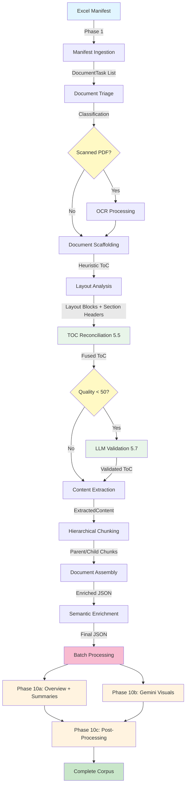
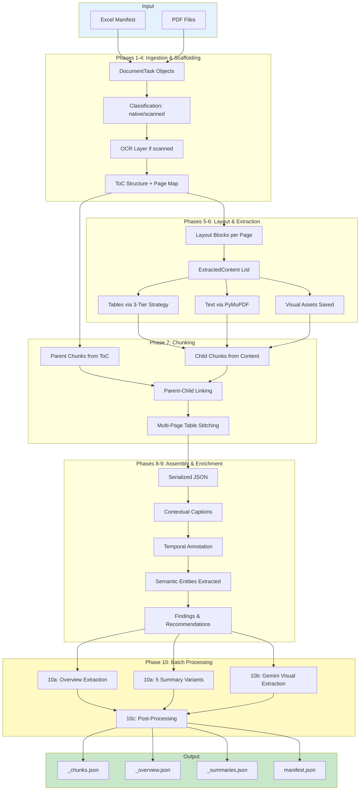

# CAG Parsing Pipeline Documentation

---

## Table of Contents

- [Pipeline Overview](#pipeline-overview)
- [Technology Stack](#technology-stack)
- [Phase-by-Phase Breakdown](#phase-by-phase-breakdown)
  - [Phase 1: Manifest Ingestion](#phase-1-manifest-ingestion)
  - [Phase 2: Document Triage](#phase-2-document-triage)
  - [Phase 3: OCR Processing](#phase-3-ocr-processing)
  - [Phase 4: Document Scaffolding](#phase-4-document-scaffolding)
  - [Phase 5: Layout Analysis](#phase-5-layout-analysis)
  - [Phase 5.5: TOC Reconciliation](#phase-55-toc-reconciliation)
  - [Phase 5.7: LLM TOC Validation](#phase-57-llm-toc-validation)
  - [Phase 6: Content Extraction](#phase-6-content-extraction)
  - [Phase 7: Hierarchical Chunking](#phase-7-hierarchical-chunking)
  - [Phase 8: Document Assembly](#phase-8-document-assembly)
  - [Phase 9: Semantic Enrichment](#phase-9-semantic-enrichment)
  - [Phase 10: Batch Processing](#phase-10-batch-processing)
- [Pipeline Outputs](#pipeline-outputs)
- [Data Flow Diagram](#data-flow-diagram)
- [File Organization Matrix](#file-organization-matrix)
- [Error Handling & Edge Cases](#error-handling--edge-cases)
- [Testing & Validation](#testing--validation)
- [Performance Metrics](#performance-metrics)
- [Trace Instrumentation](#trace-instrumentation)

---

## Pipeline Overview

The CAG Parsing Pipeline is a **10-phase document processing system** (with 2 sub-phases for TOC improvement) that transforms raw PDF audit reports into structured, semantically enriched JSON documents.

### High-Level Architecture

The pipeline follows a **sequential processing model** where each phase builds upon the outputs of previous phases. The orchestrator (`main.py`) coordinates all phases and maintains the processing state in a `DocumentTask` object.



### Core Design Principles

1. **Pipeline Modularity**: Each phase is an independent service with clear input/output contracts
2. **Fail-Fast with Recovery**: Errors in individual phases are logged but don't crash the entire pipeline
3. **Parent-Child Chunking**: Dual-level chunking for semantic search optimization
4. **Extraction Provenance**: Every extracted element tracks its source (page, bbox, model, confidence)
5. **Quality Gates**: Multi-tier fallback strategies for table/chart extraction with quality thresholds
6. **Dead Letter Queue**: Failed extractions are saved with metadata for debugging
7. **Multi-Layer TOC Validation**: 3-layer progressive TOC improvement (heuristic → AI layout → LLM validation) for ~97% accuracy
8. **Multi-Tier Support**: Automatic detection and tier-specific processing for Union, State, and Local Body reports with appropriate severity thresholds, language patterns, and entity recognition

### Key Data Structures

- **DocumentTask**: Central state object that flows through all 10 phases, accumulating metadata and content
- **ExtractedContent**: Atomic content unit from Phase 6 (paragraph, table, image)
- **ParentChunk**: Section-level chunk with ToC hierarchy (for context retrieval)
- **ChildChunk**: Atomic chunk linked to parent (for semantic search)
- **StructuredTable**: Queryable JSON representation of tables with row/column metadata
- **OverviewData**: Enhanced overview JSON with audit scope, objectives, topics, and glossary

---

## Technology Stack

| Library/Tool | Version | Purpose | Usage Context |
|-------------|---------|---------|---------------|
| **Docling** | v2.x | AI-powered layout analysis + TableFormer table extraction | Phase 5 (Layout Analysis), Tier 2 table extraction |
| **pdfplumber** | Latest | Text-stream table extraction for native PDFs | Tier 1 table extraction (native PDFs only) |
| **Tesseract OCR** | 5.x | OCR engine for scanned PDFs | Phase 3 (OCR Processing) |
| **PyMuPDF (fitz)** | Latest | PDF page rendering, text extraction with bbox clipping | Phase 3 (OCR pre-check), Phase 6 (text extraction) |
| **Gemini 2.5 Flash** | Google API | Vision-based table/chart extraction (fallback) | Tier 3 extraction (Phase 10b), chart descriptions |
| **Claude Batch API + Extended Thinking** | Anthropic API | Overview extraction, 5 summary variants | Phase 10a (overview + summaries) |
| **Claude Haiku** | Anthropic API | TOC validation for low-quality documents | Phase 5.7 (tail cases only) |
| **Pydantic** | v2.x | Data validation and serialization | All phases (data contracts) |
| **openpyxl** | Latest | Excel manifest parsing | Phase 1 (Manifest Ingestion) |
| **Pillow (PIL)** | Latest | Image cropping for visual extraction | Phase 6 (visual asset extraction) |

### Library Roles Explained

- **Docling**: Primary layout analysis engine. Provides TableFormer ACCURATE mode for high-quality table detection in scanned PDFs. Also provides Section-header detection for TOC validation.
- **pdfplumber**: Fast, accurate table extraction for native PDFs with structured text streams. Used as Tier 1 extractor before falling back to Docling or Gemini.
- **Tesseract**: Converts scanned pages to searchable PDFs using OCR layer addition. English-only (`eng`) by default; configurable for Hindi (`eng+hin`).
- **PyMuPDF**: Lightweight PDF utility for text extraction within precise bounding boxes (clip parameter) and page rendering for OCR.
- **Gemini 2.5 Flash**: Vision model for table/chart extraction when structural methods fail. Generates markdown tables and chart descriptions from images.
- **Claude Batch API**: Cost-efficient batch processing for LLM-based overview extraction and summary generation. Extended Thinking enables higher-quality analysis. 50% cost savings vs synchronous API.

---

## Phase-by-Phase Breakdown

### Phase 1: Manifest Ingestion

**Purpose**: Parse Excel manifest file to generate DocumentTask list for pipeline processing.

**Files**:
- `modules/manifest_ingestion_service.py` — Main service that reads Excel manifest and creates DocumentTask objects
- `modules/excel_analysis.py` — Helper for analyzing Excel structure and column mappings

**Logic**:
1. Read Excel manifest file (e.g., `CAG_Union_Reports.xlsx`, `CAG_State_Reports.xlsx`, `CAG_Local_Body_Reports.xlsx`)
2. **Detect government tier** from filename or `Government Body Type` column override
3. Parse each row to extract metadata fields: Title, Report No, Department, Sector, Date, Report Type, Source URL, State Name (for State/Local)
4. Generate unique `report_id` based on tier:
   - **Union**: `{year}_{serial}_{sanitized_title}`
   - **State**: `{state_code}_{year}_{no}_{sanitized_title}`
   - **Local**: `{state_code}_ATIR_{year}_{sanitized_title}`
5. Create `DocumentTask` object for each row with `initial_metadata` populated (includes `government_body_type`, `state_name`)
6. Download PDFs from URLs if not already cached locally
7. Return list of DocumentTask objects ready for Phase 2

**Input**: Excel file with columns: Title, Report No, Department, Sector, Date, Report Type, Source URL
**Output**: `List[DocumentTask]` with populated `initial_metadata` and `local_pdf_path`

**Key Features**:
- Automatic PDF download with retry logic
- Filename sanitization for cross-platform compatibility
- Duplicate detection based on report_id
- Graceful error handling for missing URLs or malformed rows

---

### Phase 2: Document Triage

**Purpose**: Classify PDFs as "native" (text-embedded) or "scanned" (image-based) to determine OCR necessity and extraction strategy routing.

**Files**:
- `modules/triage_service.py` — PDF classification service using text extraction heuristics

**Logic**:
1. Open PDF with PyMuPDF
2. Sample first N pages (default: 10, configurable) to extract text using `page.get_text()`
3. Calculate text density: `average non-whitespace characters per page`
4. Apply classification threshold:
   - If text density > 150 characters/page (default, configurable) → **native PDF**
   - If text density ≤ 150 characters/page → **scanned PDF**
5. Update `DocumentTask.classification` field
6. Log classification result for routing decisions in later phases

**Input**: `DocumentTask` with `local_pdf_path`
**Output**: `DocumentTask` with `classification` field set to "native" or "scanned"

**Key Features**:
- Configurable threshold for classification (default: 150 chars/page, 10 sample pages)
- Handles corrupted PDFs gracefully with fallback to "scanned"
- Multi-page sampling to avoid false positives from cover pages
- Routing signal for Phase 6 (table extraction tier selection)
- Configuration via `parsing_config.yaml` or environment variables

---

### Phase 3: OCR Processing

**Purpose**: Convert scanned PDFs to searchable PDFs using OCRmyPDF (Tesseract wrapper), enabling downstream text extraction.

**Files**:
- `modules/ocr_service.py` — OCRmyPDF subprocess wrapper with timeout handling

**Logic**:
1. **Skip if native PDF**: Only process documents classified as "scanned" in Phase 2
2. Run OCRmyPDF subprocess on entire PDF:
   - OCRmyPDF handles page-by-page OCR internally using Tesseract
   - Automatically embeds invisible text layer into PDF
   - Supports force OCR mode (re-OCR even if text layer exists)
   - Timeout protection (default: 600 seconds, configurable for large documents)
3. Save OCR'd PDF to `data/processed/ocred/{report_id}_ocred.pdf`
4. Update `DocumentTask.ocred_pdf_path` to point to new file
5. Log OCR statistics: total pages processed, processing time, success/failure status

**Input**: `DocumentTask` with `classification="scanned"` and `local_pdf_path`
**Output**: `DocumentTask` with `ocred_pdf_path` populated

**Key Configuration** (see `parsing_config.yaml`):
- **Language**: English only (`eng` default). To add Hindi: install `tesseract-lang-hin` and set `language='eng+hin'`
- **Timeout**: 600 seconds default (increase for 200+ page documents)
- **Output Type**: `pdfa` (PDF/A format for archival), or `pdf` for smaller files
- **Force OCR**: `true` (ensures clean OCR text even if partial text layer exists)
- **Configurable via**: `parsing_config.yaml` or `PARSING_OCR_*` environment variables

**Performance Note**: OCR is the slowest phase (10-30 seconds per page). Skip for native PDFs to save time. Large documents may require timeout adjustment.

---

### Phase 4: Document Scaffolding

**Purpose**: Extract document structure (Table of Contents, page mapping, metadata) to guide hierarchical chunking.

**Files**:
- `modules/scaffolding_service.py` — Main orchestrator for ToC extraction and metadata enrichment
- `modules/toc_table_parser.py` — Specialized parser for ToC presented as tables
- `modules/hierarchy_enricher.py` — Builds hierarchical section structure from flat ToC
- `modules/report_type_profiles.py` — Report-type specific extraction patterns (7 profiles)

**Logic**:
1. **Select PDF source**: Use OCR'd PDF for scanned docs, raw PDF for native docs
2. **Score PDF bookmarks** using `TOCQualityMetrics`:
   - Apply assembly-pattern penalty (catches garbage PDF-merger bookmarks like "01 Cover", "p001")
   - Apply CAG-pattern bonus (boosts Chapter/Annexure/Executive Summary patterns)
   - Reject bookmarks below `bookmark_quality_threshold` (default 0.6)
3. **Extract page mapping**: Roman numerals, Arabic numbers, logical page labels
5. **Parse Table of Contents** using multi-strategy approach:
   - **Pre-pass**: Printed TOC extraction from first ~15 pages using regex patterns
   - Strategy 1: Dedicated ToC page detection (heading + dot leaders)
   - Strategy 2: Table-based ToC extraction (common in CAG reports)
   - Strategy 3: Heading-based inference from document structure
6. **Normalize ToC format** to `[[level, title, page], ...]`
7. **Infer hierarchy levels** using quantile bucketing for deterministic level assignment
8. **Capture heading positions** (Y-coordinates) for accurate child chunk assignment
9. **Build hierarchy** for parent chunks (level_1, level_2, level_3, ...)
10. Store in `DocumentTask.scaffold` as dict with keys: `toc`, `page_map`, `heading_positions`, `toc_quality_metrics`

**Input**: `DocumentTask` with `local_pdf_path` or `ocred_pdf_path`
**Output**: `DocumentTask.scaffold` populated with ToC structure and metadata

#### TOC Extraction Strategies

**Strategy 0: Printed TOC Pre-pass**
1. Extract raw text from first ~15 pages
2. Apply regex patterns for common TOC formats:
   - Numbered entries: `r"^\s*(\d+\.)+\s+([A-Z][^\n]+?)\s+\.{2,}\s*(\d+)"`
   - Roman numerals: `r"^\s*([IVX]+)\.\s+([A-Z][^\n]+?)\s+\.{2,}\s*(\d+)"`
   - Lettered entries: `r"^\s*([A-Z])\.\s+([A-Z][^\n]+?)\s+\.{2,}\s*(\d+)"`
3. Parse matches into `[level, title, page]` format
4. Infer hierarchy from numbering depth

**Strategy 1: Dedicated ToC Page**
1. Scan first 15 pages for heading containing "table of contents", "contents", "index"
2. Verify dot leader patterns: `"Section Title ............... 15"`
3. Extract entries using regex: `r"^(.+?)\s*\.{2,}\s*(\d+)"`

**Strategy 2: Table-Based ToC**
1. Extract all tables from first 20 pages using pdfplumber
2. Filter for ToC-like tables (headers contain "section", "chapter", "page")
3. Parse table rows to extract title and page number
4. Infer hierarchy from indentation or numbering

**Strategy 3: Heading-Based Inference**
1. Extract all text from pages 1-50
2. Detect heading patterns: numbered (`"1.2.3 Section Title"`), formatted (all caps, bold)
3. Infer page numbers from heading locations
4. Build hierarchical structure from numbering

#### Level Inference: Quantile Bucketing

**Method** (replaces K-means for determinism):
1. Extract font sizes for all detected headings
2. Sort font sizes in descending order (larger = higher level)
3. Bucket font sizes into quantiles:
   - Top 33%: Level 1 (chapters)
   - Middle 33%: Level 2 (sections)
   - Bottom 33%: Level 3 (subsections)
4. Assign level to each heading based on its font size bucket

#### ToC Normalization

All strategies output to unified format:
```python
[
  [level, title, page_physical],
  [1, "Chapter 1: Introduction", 5],
  [2, "1.1 Background", 7],
  [2, "1.2 Audit Objectives", 9],
  [1, "Chapter 2: Findings", 12],
]
```

#### Quality Scoring

ToC quality score (0-100) based on:
- **Structure**: Presence of numbering (30 points)
- **Coverage**: Number of entries (20 points)
- **Hierarchy**: Multi-level depth (25 points)
- **Page Mapping**: Valid page references (25 points)

**Quality Gate**: Reject ToC with score < 20 or < 3 entries

#### Y-Coordinate Tracking

For multi-section pages, capture Y-coordinate of each heading:
```python
heading_positions = {
  "15_2.3 Financial Irregularities": 150.5,  # Y-position on page 15
  "15_2.4 Compliance Issues": 450.2          # Second section on same page
}
```

Used in Phase 7 to assign child chunks to correct parent when multiple sections exist on one page.

---

### Phase 5: Layout Analysis

**Purpose**: Detect and classify layout blocks (text, tables, figures, headers, footers) using AI-powered layout model.

**Files**:
- `modules/layout_analysis_service.py` — Docling v2 wrapper with TableFormer integration

**Logic**:
1. **Initialize Docling DocumentConverter** with configuration:
   - **TableFormer Mode**: ACCURATE (best quality for scanned PDFs)
   - **Cell Matching**: Enabled (improves table structure recognition)
   - **Accelerator**: CPU (MPS/CUDA not reliably available)
   - **OCR**: Disabled (already handled in Phase 3)
2. **Run conversion**: `converter.convert(source=pdf_path)`
3. **Extract layout blocks** from Docling document:
   - Iterate through `doc.iterate_items()` to get all layout elements
   - Filter by confidence threshold (default: 0.65)
   - Convert bounding boxes from bottom-left to top-left origin (PyMuPDF compatibility)
4. **Extract TableFormer tables** (Tier 2):
   - Export table markdown using `item.export_to_markdown(doc)`
   - Apply quality gate: reject tables with < 3 non-empty cells
   - Store markdown in block metadata as `docling_table_markdown`
5. **Map labels** to pipeline format:
   - Docling `PageHeader` → `Page-header`
   - Docling `Text` → `Text`
   - Docling `Table` → `Table` (with optional markdown)
   - Docling `Figure` → `Figure`
6. **Sort blocks** by reading order (top-down, left-right)
7. Store in `DocumentTask.layout` as `Dict[page_num, List[block_dict]]`

**Input**: `DocumentTask` with PDF path
**Output**: `DocumentTask.layout` with detected blocks per page

**Data Structure** (layout block):
```json
{
  "bbox": [x0, y0, x1, y1],
  "label": "Table",
  "confidence": 0.92,
  "content_type": "Table",
  "docling_table_markdown": "| Header 1 | Header 2 |\n|---|---|\n| Cell 1 | Cell 2 |",
  "docling_table_available": true
}
```

**Key Features**:
- Confidence-based filtering to reduce noise
- Coordinate system conversion for consistency
- Inline table extraction (TableFormer ACCURATE mode)
- Quality gate for table rejection (prevents garbage tables)
- **Section-header detection** provides second opinion for TOC validation (Phase 5.5)

---

### Phase 5.5: TOC Reconciliation

**Purpose**: Fuse Phase 4 heuristic TOC with Phase 5 Docling Section-header detections to produce higher-quality, validated TOC with Y-coordinates.

**Files**:
- `modules/toc_reconciliation_service.py` — TOC reconciliation service with 3-tier strategy

**Logic**:

**5.5.1 Extract Docling Section Headers**:
1. Filter layout blocks for `Section-header` label with confidence ≥ 0.60
2. For each section header block:
   - Extract text from bounding box using PyMuPDF
   - Normalize text (remove extra whitespace, standardize numbering)
   - Store: `{page, title, bbox, confidence}`
3. Infer hierarchy levels from font size, indentation, numbering patterns

**5.5.2 3-Tier Reconciliation Strategy**:

**High Quality (Phase 4 quality ≥ 70)**:
- Keep existing Phase 4 TOC as primary structure
- Supplement with Docling headers not in Phase 4 TOC (similarity threshold 0.65)
- Add missing entries at appropriate hierarchy levels

**Medium Quality (40-69)**:
- Merge both signals with equal weight
- Validate Phase 4 entries against Docling (flag low-similarity entries)
- Prefer Docling headers for tie-breaking

**Low Quality (<40)**:
- Prefer Docling headers as primary structure
- Use Phase 4 TOC only for entries with high confidence match
- More aggressive replacement of questionable entries

**5.5.3 Update Heading Positions**:
1. For each TOC entry, find matching Docling header (by title similarity)
2. Extract Y-coordinate from Docling bounding box
3. Update `scaffold.heading_positions` dictionary: `{page}_{title} → y_coordinate`
4. Enables Y-aware chunking in Phase 7 for multi-section pages

**5.5.4 Recalculate Quality Score**:
- Factor in Docling validation signal
- Boost score if Phase 4 and Docling agree on entries
- Penalize if significant disagreement

**Input**: `DocumentTask` with `scaffold` (Phase 4) and `layout` (Phase 5)
**Output**: `DocumentTask` with updated `scaffold.toc`, `scaffold.heading_positions`, `scaffold.toc_quality`

**Quality Thresholds**:
- Similarity threshold: 0.65 (for title matching)
- Min Docling headers: 3 (to consider signal usable)
- Confidence threshold: 0.60 (for Section-header blocks)
- MAX_L1_COUNT: 35 (fires `l1_count_excessive` red flag if exceeded)
- ORPHAN_RATIO_THRESHOLD: 0.75 (fires `orphan_sections_detected` if orphan ratio exceeds this)

**Key Features**:
- **Dual-signal validation**: Cross-validates heuristic TOC with AI layout model
- **Quality-aware strategy**: Different reconciliation approaches based on Phase 4 quality
- **Y-coordinate enrichment**: Adds precise heading positions for multi-section pages
- **Graceful fallback**: If Docling has insufficient headers, keeps Phase 4 TOC unchanged

TOC accuracy improves from ~90% to ~95% by correcting heuristic errors through Docling validation.

---

### Phase 5.7: LLM TOC Validation

**Purpose**: Last resort validation for low-quality TOCs (quality < 50) using Claude Haiku to analyze raw document text and extract/correct TOC structure.

**Files**:
- `modules/toc_llm_validator.py` — LLM-based TOC validator using Claude Haiku

**Logic**:

**5.7.1 Eligibility Check**:
1. Check if `scaffold.toc_quality < 50` (validation threshold)
2. Check if `ANTHROPIC_API_KEY` is set (graceful skip if not)
3. Proceed only if both conditions met (~10-20% of corpus)

**5.7.2 Document Text Extraction**:
1. Open PDF using PyMuPDF
2. Extract raw text from first ~15 pages (typical TOC location)
3. Truncate to 8,000 characters (model context limit)
4. Clean text: normalize whitespace, remove artifacts

**5.7.3 LLM Validation**:
1. Construct prompt with:
   - System prompt: Expert document structure analyzer instructions
   - User prompt: Existing TOC (if any) + raw document text
   - Request: Return corrected TOC as JSON array `[[level, title, page], ...]`
2. Call Claude Haiku API with structured output
3. Parse response as JSON array

**5.7.4 Page Number Conversion**:
1. LLM returns **logical page numbers** (as printed in document)
2. Convert to **physical page numbers** (0-indexed PDF pages):
   - Use `scaffold.page_map` for mapping
   - Handle Roman numerals (i, ii, iii) → physical pages
   - Handle Arabic numerals (1, 2, 3) → physical pages
3. Update TOC entries with physical page numbers

**5.7.5 Quality Score Update**:
- Set quality to **70-85** (confident but not perfect)
- Never set to 100 (LLM isn't ground truth)
- Score based on TOC length, hierarchy depth, entry quality

**Input**: `DocumentTask` with low-quality TOC (quality < 50)
**Output**: `DocumentTask.scaffold` with validated TOC and updated quality score

**Cost Analysis**:
- Model: Claude Haiku (cost-efficient)
- Per-report cost: $0.01-0.02
- Corpus cost (1,297 reports × 15% eligibility): ~$2-4 total
- Triggered only for ~10-20% of corpus (low-quality TOCs)

**Graceful Fallback**:
- If `ANTHROPIC_API_KEY` not set, skips validation silently
- If API call fails, keeps existing TOC (no crash)
- If JSON parsing fails, falls back to existing TOC

**Key Features**:
- **Cost-effective**: Uses Haiku (cheapest Claude model), only for tail cases
- **Smart eligibility**: Only validates when Phase 4 + Phase 5.5 insufficient
- **Page mapping integration**: Handles logical → physical conversion
- **Conservative scoring**: Never claims perfection (caps at 85)
- **No hard dependency**: Pipeline works without API key (graceful degradation)

TOC accuracy improves from ~95% to ~97%+ for tail cases.

---

### Phase 6: Content Extraction

**Purpose**: Extract textual/tabular/visual content from layout blocks using specialized extractors with router-dispatcher pattern.

**Files**:
- `modules/content_extraction_service.py` — Router-dispatcher orchestrator with 3-tier table routing
- `extractors/text_extractor.py` — PyMuPDF bbox-clipped text extraction with normalization
- `extractors/pdfplumber_table_extractor.py` — Tier 1 table extractor for native PDFs
- `modules/structured_table_extractor.py` — Converts markdown tables to queryable JSON (StructuredTable)
- `modules/chunk_filter_service.py` — Garbage filtering service (removes headers/footers/noise)
- `modules/multi_page_table_handler.py` — Stitches tables split across pages

**Logic**:

**6.1 Router-Dispatcher Pattern**:
1. Build routing map: `label → extractor_function`
   - `Table` → 3-tier strategy (see below)
   - `Text/Section-header/Title/List-item` → `TextExtractor`
   - `Picture/Figure` → Visual asset saver (for Phase 10b Gemini extraction)
   - `Footnote` → Dedicated footnote handler with number detection
   - `Page-header/Page-footer` → Skip (noise elements)
2. Iterate through `DocumentTask.layout` blocks
3. Route each block to appropriate extractor based on label
4. Aggregate results into `DocumentTask.extracted_content`

**6.2 3-Tier Table Extraction Strategy**:

**Native PDFs**:
| Tier | Method | Tool | Quality Gate | Fallback Trigger |
|------|--------|------|--------------|------------------|
| 1 | Text-stream extraction | pdfplumber | Minimum 2x2 cells | No table found or parsing error |
| 2 | Layout-based TableFormer | Docling ACCURATE | ≥3 non-empty cells | No markdown output or quality gate fail |
| 3 | Vision-based extraction | Gemini 2.5 Flash | Manual review | All structural methods exhausted |

**Scanned PDFs**:
| Tier | Method | Tool | Quality Gate | Fallback Trigger |
|------|--------|------|--------------|------------------|
| ~~1~~ | ~~Text-stream~~ | ~~Skipped~~ | ~~N/A~~ | No text stream in scanned PDFs |
| 2 | Layout-based TableFormer | Docling ACCURATE | ≥3 non-empty cells | No markdown output or quality gate fail |
| 3 | Vision-based extraction | Gemini 2.5 Flash | Manual review | Structural method failed |

**Extraction Provenance**: All tables track `extraction_method` field:
- `"pdfplumber-lines_strict"` — Tier 1
- `"docling-tableformer"` — Tier 2
- `"gemini-2.5-flash"` — Tier 3

**6.3 Text Extraction** (`TextExtractor`):
1. Use PyMuPDF's `page.get_text("text", clip=rect)` for bbox-clipped extraction
2. **Rotation handling (P1-11)**:
   - Detect page rotation via `page.rotation` (0°, 90°, 180°, 270°)
   - For 90°/270° pages: Use dict-based extraction with sort=True for correct reading order
   - For 180° pages: Detect reversed content and apply word-level reversal
   - Track `page_rotation` in `structured_data` for downstream debugging
3. **Reversed content detection (D9-FIX)**:
   - Content-agnostic heuristic: Look for known reversed word patterns ("elbaliava", "stneduts")
   - Structural heuristic: Detect unusual lowercase+uppercase transitions (reversed proper nouns)
   - If detected, apply word-level reversal per block (preserves whitespace/line structure)
   - Note: This is a best-effort recovery; some reversed text may remain (see Known Limitations)
4. Normalize text:
   - Replace ligatures (fi → fi, fl → fl)
   - Remove soft hyphens and zero-width spaces
   - Rejoin hyphenated words at line breaks
   - Normalize whitespace
5. Classify content type: `paragraph`, `header`, or `list`
6. Return `ExtractedContent` object with `extraction_method` and `extraction_confidence` populated

**6.4 Visual Asset Extraction**:
1. Crop image from PDF page using bbox coordinates
2. Save to `data/extraction_images/charts/{report_id}_{page}_{hash}.png`
3. Classify visual subtype (chart, map, flowchart, diagram, photo)
4. Store image path in `ExtractedContent.content` for Phase 10b processing

**6.5 Cross-Page Paragraph Merging**:
- Detect paragraphs split across pages using heuristics:
  - Last paragraph on page N ends without proper punctuation (e.g., lowercase, comma, preposition)
  - First paragraph on page N+1 starts with lowercase or continuation word
- Merge text and preserve original page/bbox from first fragment
- Log merge count for validation

**6.6 Garbage Filtering** (`ChunkFilterService`):
- Remove common noise patterns:
  - Page numbers in isolation
  - Headers/footers repeated across pages
  - Single-word fragments
  - Repetitive strings (e.g., "...................")
- Log filtered chunk count

**Input**: `DocumentTask.layout` from Phase 5
**Output**: `DocumentTask.extracted_content` as `List[ExtractedContent]`

**ExtractedContent Structure**:
```json
{
  "content_type": "paragraph",
  "content": "The Ministry failed to comply with...",
  "source_page_physical": 15,
  "source_bbox": [72.0, 150.3, 523.2, 180.7],
  "model_used": "PyMuPDF-clip",
  "layout_label": "Text",
  "layout_confidence": 0.87,
  "structured_data": null
}
```

**StructuredTable JSON Format**:
```json
{
  "table_id": "table_15_72_150",
  "source_chunk_id": "...",
  "source_page_physical": 15,
  "source_bbox": [72.0, 150.0, 523.2, 400.0],
  "markdown_representation": "| Header 1 | Header 2 |\n|---|---|\n| Cell 1 | Cell 2 |",
  "extraction_method": "pdfplumber-lines_strict",
  "is_multi_page": false,
  "source_pages": [15],
  "headers": [
    {"text": "Header 1", "col_index": 0},
    {"text": "Header 2", "col_index": 1}
  ],
  "rows": [
    {
      "row_index": 0,
      "cells": [
        {"text": "Cell 1", "col_index": 0},
        {"text": "Cell 2", "col_index": 1}
      ]
    }
  ],
  "row_count": 1,
  "col_count": 2,
  "caption": "Table 2.1: Summary of Findings",
  "table_number": "2.1"
}
```

**Key Features**:
- Multi-tier fallback for table extraction (never fails)
- Dead letter queue for failed extractions (saves image + metadata for debugging)
- Cross-page paragraph merging for better retrieval
- Structured table JSON for queryable analytics
- Extraction provenance tracking (model, confidence, source)

---

### Phase 7: Hierarchical Chunking

**Purpose**: Create parent-child chunk pairs for dual-level retrieval pattern.

**Files**:
- `modules/chunking_service.py` — Parent-child chunk builder with hierarchy propagation
- `modules/multi_page_table_handler.py` — Multi-page table stitching before chunking

**Logic**:

**7.1 Multi-Page Table Stitching**:
1. Extract all tables from `extracted_content` with `structured_data`
2. Detect multi-page tables using heuristics:
   - Sequential pages (gap tolerance: MAX_PAGE_GAP = 3)
   - Matching column structure (header similarity > 80%)
   - Content continuation indicators (e.g., "contd." in header)
3. **Missing-page detection (P0-03)**:
   - Compare extracted pages against `expected_span` from TOC/layout (true span, not min/max of fragments)
   - For each gap, emit `multi_page_table_page_lost` red flag with reason codes:
     - `no_fragment_extracted`: Tier-1/Tier-2 produced zero fragments for this page
     - `interior_dropped`: Interior page detected but dropped during chain iteration
   - DLQ entries saved to `processing_metadata.dlq_entries` for debugging
4. Merge table rows and update metadata (page_range, is_multi_page flag)
5. Replace fragments with single merged table in `extracted_content`

**Known Limitation**: Pages where Tier-1 (pdfplumber) and Tier-2 (Docling) both fail to produce any table fragment remain unextracted. These are now flagged in DLQ rather than silently dropped, but the content is not recovered.

**7.2 Parent Chunk Creation**:
1. **Source**: ToC entries from `DocumentTask.scaffold.toc`
2. For each ToC entry `[level, title, page]`:
   - Generate unique `chunk_id`: hash of `report_id + level + title + index`
   - Calculate page range:
     - Start: ToC entry page
     - End: Page before next same-level or higher-level section (forward-looking)
     - Guarantee: `end_page >= start_page` (enforced)
   - Build hierarchy dict: `{level_1: "Chapter 2", level_2: "2.1 Audit Findings", ...}`
   - Capture Y-position from `heading_positions` for multi-section pages
3. **Fallback**: If no ToC, create single document-level parent covering all pages

**7.3 Child Chunk Creation**:
1. Iterate through `extracted_content` (paragraphs, tables, images)
2. For each content item:
   - Assign to **most specific (deepest level) parent** whose page range contains this item's page
   - If Y-positions available, filter parents by vertical position to handle multi-section pages
   - Inherit **full hierarchy** from assigned parent
   - Generate unique `chunk_id`: hash of `report_id + parent_id + page + bbox + content_hash`
   - Link via `parent_chunk_id`
3. Create `ChildChunk` object with all metadata

**Input**: `DocumentTask` with `scaffold` and `extracted_content`
**Output**: `(List[ParentChunk], List[ChildChunk])`

**Parent Chunk Structure**:
```json
{
  "chunk_id": "2023_07_parent_abc123",
  "report_id": "2023_07_Performance_Audit_...",
  "hierarchy": {
    "level_1": "Chapter 2: Audit Findings",
    "level_2": "2.3 Financial Irregularities"
  },
  "page_range_physical": [15, 28],
  "page_range_logical": ["15", "28"],
  "toc_entry": "2.3 Financial Irregularities",
  "toc_level": 2,
  "start_y_position": 150.5,
  "content_summary": null
}
```

**Child Chunk Structure**:
```json
{
  "chunk_id": "2023_07_child_xyz789",
  "parent_chunk_id": "2023_07_parent_abc123",
  "content_type": "paragraph",
  "content": "The audit revealed irregular expenditure...",
  "report_id": "2023_07_Performance_Audit_...",
  "report_title": "Performance Audit on...",
  "report_no": "7 of 2023",
  "hierarchy": {
    "level_1": "Chapter 2: Audit Findings",
    "level_2": "2.3 Financial Irregularities"
  },
  "source_page_physical": 18,
  "source_page_logical": "18",
  "source_bbox": [72.0, 200.5, 523.2, 250.8],
  "structured_data": null
}
```

**Key Features**:
- Most specific parent assignment (deepest level match)
- Y-coordinate aware assignment for multi-section pages
- Full hierarchy inheritance from parent
- Multi-page table stitching before chunking
- Guaranteed valid page ranges (end >= start)

---

### Phase 8: Document Assembly

**Purpose**: Serialize hierarchical chunks to JSON with metadata enrichment.

**Files**:
- `modules/assembly_service.py` — JSON assembly orchestrator with enrichment pipeline
- `enrichment/contextual_caption_service.py` — Replaces generic image captions with context
- `enrichment/temporal_extractor.py` — Extracts temporal references
- `enrichment/annexure_linker.py` — Links chunks to annexures
- `enrichment/cross_reference_resolver.py` — Resolves cross-references (para X, table Y, section Z)

**Logic**:

**8.1 Report Metadata Extraction**:
1. Extract `report_year` (integer) for filtering:
   - Try publication_date: `"2023-08-10"` → 2023
   - Try report_id: `"2023_07_..."` → 2023
   - Try Report No: `"15 of 2023"` → 2023
2. Build report_metadata dict with all fields

**8.2 Parent Chunk Serialization**:
- Convert `ParentChunk` Pydantic objects to dicts
- Preserve all fields for Phase 10a summary hydration

**8.3 Child Chunk Serialization** (`_serialize_child_chunks`):
1. Convert `ChildChunk` to dict
2. Add top-level fields for easy indexing:
   - `report_id`, `report_year`, `report_title`, `report_no`
   - `hierarchy`, `source_page_physical`, `source_page_logical`
   - **`extraction_method`**: Propagated from extractor (e.g., "pdfplumber-lines_strict", "docling-tableformer")
   - **`extraction_confidence`**: Composite confidence score 0.0-1.0
3. Nest detailed metadata under `metadata.source`, `metadata.location`, `metadata.extraction`
4. Include `structured_data` for tables (queryable JSON)

**Note**: This is the serialization point where extraction provenance fields (`extraction_method`, `extraction_confidence`) reach the final JSON output. The D1 fix ensures these fields are populated at the top-level of each child_chunk.

**8.4 Enrichment Features**:

**Contextual Image Captions**:
- Detect generic captions (e.g., "The image shows a black background with...")
- Replace with context from parent chunk hierarchy: `"Figure in {section_title}: {generic_caption}"`

**Temporal Annotation**:
- Extract temporal references from paragraph text:
  - Absolute dates: "2021-22", "FY 2023-24", "March 2022"
  - Relative dates: "as of March 2023", "during 2021-22"
  - Fiscal years: "2020-21", "FY 2023-24"
- Add `temporal_references` field to chunk with structured dates

**Extraction Confidence**:
- Compute composite confidence score (0.0-1.0) from:
  - Layout confidence (40% weight)
  - ToC quality score (30% weight)
  - Content quality heuristic (30% weight)
- Add `extraction_confidence` field to all chunks

**Footnote Index**:
- Build flat index of all footnotes:
  ```json
  {
    "1": {
      "chunk_id": "...",
      "content": "[Footnote 1] FSSAI standards...",
      "page": 15,
      "parent_section": "2.3 Findings"
    }
  }
  ```
- Enables footnote lookup by number

**Visual Asset Registry**:
- Build registry of all tables and figures:
  ```json
  {
    "total_tables": 45,
    "total_figures": 12,
    "tables_by_section": {
      "Chapter 2": [
        {
          "chunk_id": "...",
          "page": 15,
          "caption": "Table 2.1: Irregular Expenditure",
          "row_count": 8,
          "col_count": 4
        }
      ]
    },
    "figures_by_section": {...}
  }
  ```
- Enables frontend navigation to visual assets

**8.5 Output Generation**:
1. Write assembled JSON to `data/processed/{report_id}_chunks.json`
2. Update corpus manifest at `data/processed/manifest.json`
3. Log assembly statistics

**Input**: `DocumentTask`, `List[ParentChunk]`, `List[ChildChunk]`
**Output**: JSON file with complete enriched chunk data

---

### Phase 9: Semantic Enrichment

**Purpose**: Extract CAG-specific semantic entities (findings, recommendations, monetary values, entities) for cross-report analytics with **multi-tier taxonomy support** for Union, State, and Local Body reports.

**Files**:
- `modules/semantic_enrichment_service.py` — Slim orchestrator coordinating focused extractors (findings, entities, sections, recommendations)
- `modules/enrichment/finding_extractor.py` — Finding extraction with tier-specific severity classification
- `modules/enrichment/entity_extractor.py` — Extracts schemes, ministries, organizations
- `modules/enrichment/section_classifier.py` — Classifies sections by semantic type
- `modules/enrichment/box_element_extractor.py` — Detects illustrative box elements
- `modules/enrichment/monetary_processor.py` — Extracts and normalizes monetary values to paise
- `modules/enrichment/recommendation_extractor.py` — Multi-strategy recommendation extraction (structural, numbered, verb-based)
- `modules/enrichment/temporal_extractor.py` — Temporal reference extraction (audit periods, fiscal years)
- `modules/enrichment/annexure_linker.py` — Links chunks to annexures
- `modules/enrichment/cross_reference_resolver.py` — Resolves cross-references (para X, table Y, section Z)
- `modules/enrichment/executive_summary_parser.py` — Parses executive summary index with citation resolution
- `modules/enrichment/contextual_caption_service.py` — Replaces generic image captions with contextual ones (used by Phase 8)
- `modules/semantic_patterns.py` — Enhanced pattern library (87+ State/Local-specific regex patterns)
- `modules/report_type_profiles.py` — Report-type specific extraction patterns (7 profiles)
- `modules/evidence_linker.py` — Links findings to supporting evidence chunks (tables, paragraphs)

**Logic**:

**9.1 Report Type Detection**:
1. Analyze report title and metadata
2. Classify into one of 7 profiles:
   - Compliance Audit
   - Performance Audit
   - Financial Audit
   - Revenue Audit
   - Railways Audit
   - Defence Audit
   - General Purpose Financial Reports
3. Load type-specific extraction patterns

**9.2 Finding Extraction**:
1. Iterate through child chunks (paragraphs)
2. For each chunk:
   - Extract monetary values using regex patterns (₹ X crore, Rs. Y lakh)
   - Normalize to INR paise for comparison: `₹847.71 crore` → 84771000000 paise
   - Classify finding type using pattern matching:
     - **Common types** (all tiers): Irregular Expenditure, Loss of Revenue, Wasteful Expenditure, Non-Compliance, System Deficiency, Performance Shortfall, Fraud/Misappropriation, Procedural Lapse
     - **State/Local-specific types**: Idle Assets, Non-Realization of Dues, Incomplete Infrastructure, Accounting Irregularity, Fund Utilization Failure
   - Calculate severity based on monetary value using **tier-specific thresholds**:
     - **Union reports**: CRITICAL ≥ ₹100 crore, HIGH ≥ ₹10 crore, MEDIUM ≥ ₹1 crore, LOW < ₹1 crore
     - **State reports**: CRITICAL ≥ ₹50 crore, HIGH ≥ ₹5 crore, MEDIUM ≥ ₹0.5 crore, LOW < ₹0.5 crore
     - **Local Body reports**: CRITICAL ≥ ₹10 crore, HIGH ≥ ₹1 crore, MEDIUM ≥ ₹0.1 crore, LOW < ₹0.1 crore
   - Link to source chunk and parent section hierarchy
3. Create `Finding` objects with structured data

**Multi-Tier Support**: The pipeline automatically detects report tier (Union/State/Local Body) from filename or manifest metadata and applies appropriate severity thresholds. State and Local Body reports use language-specific patterns (GST/ITC terminology, PRI/ULB entities) for higher extraction accuracy.

**9.3 Recommendation Extraction** (3-strategy approach):
1. **Strategy 1: Structural** — Dedicated "Recommendations" section
   - Detect section by title matching
   - Extract all child chunks in that section
2. **Strategy 2: Numbered** — Numbered list items starting with "Recommendation"
   - Detect patterns like `"Recommendation 1.2.3:"`
   - Extract recommendation text
3. **Strategy 3: Verb-based** — Pattern matching for action verbs
   - Match patterns: "Ministry should...", "Audit recommends that...", "It is suggested..."
   - Extract target entity (Ministry, Department, Railways)
   - Extract action text
4. For each recommendation:
   - Generate unique ID
   - Link to source chunk and section
   - Extract addressee (target entity)
   - Classify priority based on severity keywords (urgent, immediate, critical)

**9.4 Entity Extraction**:
1. **Schemes/Programs**:
   - Pattern: `"Pradhan Mantri Gram Sadak Yojana (PMGSY)"`
   - Requires capitalized start, max 60 chars
   - Filters out verb phrases
2. **Ministries/Departments**:
   - Pattern: `"Ministry of Road Transport and Highways"`
   - Stops before "and Ministry" (separate entity)
   - Allows internal "&" for names like "Micro, Small & Medium Enterprises"
3. **Organizations**:
   - Railways, PSUs, Authorities, Commissions
   - Acronym detection: INCOIS, ISRO, NHAI, etc.
4. **Rejection Filters**:
   - Remove sentence fragments starting with verbs (was, were, noted, etc.)
   - Remove fragments with prepositions (under, during, after, etc.)

**9.5 Section Classification**:
- Tag sections by semantic type using pattern matching:
  - Executive Summary, Introduction, Audit Objectives
  - Audit Scope, Methodology, Criteria
  - Findings, Recommendations, Conclusion
  - Annexure, Glossary, Acknowledgement

**9.6 Monetary Aggregation**:
- Sum all monetary values by category:
  - Total irregular expenditure
  - Total revenue loss
  - Total wasteful expenditure
- Generate statistics for report overview

**Input**: Assembled JSON from Phase 8
**Output**: Enriched JSON with `semantic_enrichment` field

**Semantic Enrichment Structure**:
```json
{
  "findings": [
    {
      "finding_id": "2023_07_finding_001",
      "finding_type": "irregular_expenditure",
      "severity": "high",
      "monetary_value": {
        "raw_text": "₹847.71 crore",
        "amount": 847.71,
        "unit": "crore",
        "normalized_inr": 84771000000
      },
      "description": "Irregular expenditure on...",
      "source_chunk_id": "...",
      "source_section": "2.3 Financial Irregularities",
      "evidence_chunk_ids": ["...", "..."]
    }
  ],
  "recommendations": [
    {
      "recommendation_id": "2023_07_rec_001",
      "text": "The Ministry should strengthen internal controls...",
      "addressee": "Ministry of Road Transport and Highways",
      "priority": "high",
      "source_chunk_id": "...",
      "source_section": "Chapter 5: Recommendations"
    }
  ],
  "entities": {
    "schemes": ["Pradhan Mantri Gram Sadak Yojana", ...],
    "ministries": ["Ministry of Road Transport and Highways", ...],
    "organizations": ["National Highways Authority of India", ...]
  },
  "monetary_aggregates": {
    "total_irregular_expenditure": 123456789000,
    "total_revenue_loss": 45678900000,
    "total_wasteful_expenditure": 12345600000
  }
}
```

**Key Features**:
- Report-type aware extraction (7 profiles)
- Monetary value normalization to paise for precision
- 3-strategy recommendation extraction (never misses)
- Evidence linking for findings
- Entity extraction hardening (filters verb phrases)
- Severity classification for findings

**Red Flag Thresholds (Report-Type Aware)**:

The `finding_other_ratio_high` flag fires only when the 'other' finding percentage exceeds a report-type-specific threshold:

| Report Type | Threshold | Rationale |
|------------|-----------|-----------|
| `compliance` | 40% | Standard compliance audits |
| `performance` | 35% | Performance audits have clear finding categories |
| `financial` | 50% | Financial audits have many accounting misstatements |
| `atir` | 40% | ATI reports vary widely |
| `default` | 40% | Fallback for unknown types |

**ATI Inflation Guard**: The `other_count` is clamped to `min(other_count, total_findings)` to prevent double-counting bugs from producing >100% ratios.

**Monetary Total Implausibility**: The `monetary_total_implausible` flag has tier-specific thresholds:
- Union: ₹5 lakh crore
- State: ₹1 lakh crore
- Local Body: ₹10,000 crore

Additionally, Financial Audit reports (`audit_category="financial"`) use relaxed thresholds (10x higher) since aggregate financial statements legitimately contain very large totals.

---

### Phase 10: Batch Processing

**Purpose**: LLM-based enrichment (overview extraction, summary generation) and vision extraction using batch APIs for cost efficiency.

**Files**:
- `batch_pipeline/batch_service.py` — Anthropic Batch API service with Extended Thinking
- `batch_pipeline/phase10_service.py` — High-level orchestrator for Phase 10
- `batch_pipeline/submit_jobs.py` — CLI for batch job submission
- `batch_pipeline/check_status.py` — Batch job status checker
- `batch_pipeline/process_results.py` — Result hydration service
- `batch_pipeline/prompts/overview_extraction.py` — Overview extraction prompt builder
- `batch_pipeline/prompts/summary_variants.py` — 5 summary variant prompts
- `batch_pipeline/enrichment/gemini_visual_extractor.py` — Gemini vision-based table/chart extraction (Tier 3)
- `batch_pipeline/enrichment/visual_post_processor.py` — Hydration, TOC filtering, title enrichment
- `batch_pipeline/merge_utils.py` — Utilities for merging batch results into overview JSONs

**Sub-Phases**:

#### Phase 10a: Overview Extraction + Summary Generation

**10a.1 Enhanced Overview Extraction**

For each report, extracts structured metadata into `{report_id}_overview.json`:

1. **Prepare Overview Prompt**:
   - Include TOC from parent_chunks (structure)
   - Include intro/scope content from child_chunks (details)
   - Include glossary section content if available
   - Include executive summary/preface content

2. **Extract via Claude Batch API**:
   - **Audit Scope**: Period covered, geographic coverage, sample size, entities audited
   - **Audit Objectives**: List of objectives from the report
   - **Topics Covered**: Neutral topic names with descriptions, sections, and page ranges
   - **Glossary Terms**: Abbreviations and definitions with categories

3. **Merge with Algorithmically Extracted Data**:
   - `basic_info`: From report_metadata
   - `table_of_contents`: From parent_chunks
   - `findings_summary`: Aggregated statistics
   - `findings_list`: Detailed findings with severity, type, amounts
   - `entities`: Schemes, ministries, organizations

**10a.2 Five AI Summary Variants**

For each report, generates 5 different summary perspectives using Claude Batch API with Extended Thinking:

| Variant | Name | Target Audience | Word Count | Model |
|---------|------|-----------------|------------|-------|
| `executive` | Executive Brief | C-suite, policymakers | 2,200-2,500 | Claude Sonnet |
| `journalist` | Journalist's Take | General public, news media | 2,000-2,200 | Claude Opus |
| `deep_dive` | Deep Dive | Researchers, academics | 3,500-4,000 | Claude Opus |
| `simple` | Simple Explainer | Non-experts | 1,200-1,500 | Claude Sonnet |
| `policy` | Policy Brief | Government officials | 2,200-2,500 | Claude Sonnet |

**Extended Thinking Configuration**:
- Budget tokens vary by variant (5,000-16,000)
- Enables deeper analysis and higher-quality reasoning
- Batch API provides 50% cost savings over synchronous calls

**10a.3 Batch Job Lifecycle**:
1. Prepare prompts for all reports (overview + 5 summaries each)
2. Submit to Anthropic Batch API → receive batch_id
3. Create job tracker: `data/batch_jobs/jobs/job_{timestamp}.json`
4. Poll for completion (typically 1-2 hours)
5. Download results from batch API
6. Parse and store:
   - Overviews: `data/batch_jobs/overviews/{report_id}_overview_llm.json`
   - Summaries: `data/batch_jobs/summaries/{report_id}_summaries.json`
7. Merge LLM-extracted fields into final `{report_id}_overview.json`

#### Phase 10b: Gemini Visual Extraction (Tier 3 Fallback)

1. Collect all saved chart/table images from Phase 6 (where Tier 1 and 2 failed)
2. For each image:
   - Send to Gemini 2.5 Flash with vision prompt:
     - For tables: "Extract table as markdown, preserve structure"
     - For charts: "Describe chart type, axes, data points, insights"
   - Parse response to structured format
3. Generate `StructuredTable` JSON from markdown
4. Create batch job for all images (cost: ~$0.02 per image)
5. Submit and wait for completion

#### Phase 10c: Visual Post-Processing

1. **Hydration**: Replace image paths in child chunks with extracted content
2. **TOC Filtering**: Remove chunks from TOC/preface pages (not substantive content)
3. **Title Enrichment**: Add chart/table numbers and captions from parent hierarchy
4. Re-save final enriched JSON

**Input**: Phase 8/9 JSON files
**Output**: Final enriched JSON files + overview files + summary files

**Folder Structure**:
```
data/batch_jobs/
├── jobs/
│   ├── job_YYYYMMDD_HHMMSS.json      # Job tracker
│   └── job_YYYYMMDD_HHMMSS_mapping.json  # ID mapping
├── overviews/
│   └── {report_id}_overview_llm.json  # LLM-extracted fields
└── summaries/
    └── {report_id}_summaries.json     # 5 summary variants
```

---

## Pipeline Outputs

The pipeline produces three primary output deliverables per report, plus a corpus-level manifest.

### A. Chunks JSON: `{report_id}_chunks.json`

The primary structured output containing all extracted and enriched content.

**Location**: `data/processed/{report_id}_chunks.json`

**Structure**:
```json
{
  "report_metadata": {
    "report_id": "2023_07_...",
    "report_title": "...",
    "report_no": "7 of 2023",
    "report_year": 2023,
    "ministry": "...",
    "sector": "...",
    "report_type": "Compliance Audit",
    "publication_date": "2023-08-10",
    "source_url": "https://...",
    "source_filename": "..."
  },
  "parent_chunks": [
    {
      "chunk_id": "...",
      "hierarchy": {"level_1": "...", "level_2": "..."},
      "page_range_physical": [15, 28],
      "toc_entry": "...",
      "toc_level": 2,
      "content_summary": null
    }
  ],
  "child_chunks": [
    {
      "chunk_id": "...",
      "parent_chunk_id": "...",
      "content_type": "paragraph",
      "content": "...",
      "hierarchy": {...},
      "source_page_physical": 18,
      "structured_data": null,
      "extraction_method": "pdfplumber-lines_strict",
      "extraction_confidence": 0.87
    }
  ],
  "footnote_index": {
    "1": {"chunk_id": "...", "content": "...", "page": 15}
  },
  "visual_asset_registry": {
    "total_tables": 45,
    "total_figures": 12,
    "tables_by_section": {...},
    "figures_by_section": {...},
    "extraction_stats": {"pdfplumber-lines_strict": 30, "docling-tableformer": 15}
  },
  "semantic_enrichment": {
    "findings": [...],
    "recommendations": [...],
    "entities": {...},
    "monetary_aggregates": {...}
  },
  "processing_stats": {
    "total_pages": 120,
    "total_parent_chunks": 45,
    "total_child_chunks": 352,
    "table_count": 28,
    "figure_count": 12,
    "phase_10b_complete": false
  },
  "processing_metadata": {
    "dlq_entries": []
  }
}
```

### B. Overview JSON: `{report_id}_overview.json`

Enhanced overview with LLM-extracted metadata, designed for report browsing and navigation.

**Location**: `data/processed/{report_id}_overview.json`

**Structure**:
```json
{
  "basic_info": {
    "report_id": "...",
    "report_number": "07 of 2023",
    "report_year": 2023,
    "title": "...",
    "ministry": "...",
    "sector": "...",
    "report_type": "Compliance Audit",
    "publication_date": "2023-08-10",
    "source_url": "...",
    "source_filename": "..."
  },
  "table_of_contents": [
    {
      "id": "...",
      "title": "Chapter 1: Introduction",
      "level": 1,
      "page_start": 10,
      "page_end": 18,
      "hierarchy": {"level_1": "Chapter 1: Introduction"}
    }
  ],
  "findings_summary": {
    "total_count": 46,
    "total_monetary_crore": 10839.54,
    "by_severity": {"critical": 17, "high": 6, "medium": 3, "low": 20},
    "by_type": {
      "non_compliance": {"count": 6, "total_crore": 882.3},
      "loss_of_revenue": {"count": 12, "total_crore": 1596.72}
    }
  },
  "findings_list": [
    {
      "id": "...",
      "severity": "critical",
      "type": "non_compliance",
      "amount_crore": 132.05,
      "chapter": "Executive Summary",
      "section": "...",
      "page": 12,
      "text": "...",
      "summary": "..."
    }
  ],
  "entities": {
    "schemes": ["..."],
    "ministries": ["..."],
    "organizations": ["..."]
  },
  "audit_scope": {
    "period": {
      "start": "2017-18",
      "end": "2020-21",
      "description": "4 Financial Years"
    },
    "geographic_coverage": ["Tamil Nadu", "Karnataka", "..."],
    "sample_size": {
      "total": 41,
      "description": "41 Toll Plazas out of 154 total..."
    },
    "entities_covered": ["NHAI Regional Offices", "..."]
  },
  "audit_objectives": [
    "to assess whether the system of toll collection...",
    "to assess whether the maintenance of NHs..."
  ],
  "topics_covered": [
    {
      "name": "Toll Collection Operations",
      "sections": ["3.1.1", "3.1.2", "..."],
      "page_start": 26,
      "page_end": 34,
      "description": "Toll fee implementation, collection mechanisms..."
    }
  ],
  "glossary_terms": [
    {
      "term": "National Highways Authority of India",
      "abbreviation": "NHAI",
      "definition": "Constituted by GoI as per the NHAI Act, 1988...",
      "category": "organizational"
    }
  ],
  "_metadata": {
    "generated_at": "2026-02-19T15:11:50.271646",
    "source_json": "data/processed/..._chunks.json",
    "llm_extraction_available": true,
    "summaries_available": true,
    "summaries_path": "data/batch_jobs/summaries/..._summaries.json"
  }
}
```

### C. Summaries JSON: `{report_id}_summaries.json`

Five AI-generated summary variants for different audiences.

**Location**: `data/batch_jobs/summaries/{report_id}_summaries.json`

**Structure**:
```json
{
  "report_id": "2023_07_...",
  "generated_at": "2026-02-19T15:11:50.134429",
  "variants": {
    "executive": {
      "content": "# Executive Brief\n\n## Context & Scope\n...",
      "word_count": 1452,
      "thinking_used": true
    },
    "journalist": {
      "content": "# Headlines\n\n## Main Headline\n...",
      "word_count": 2053,
      "thinking_used": true
    },
    "deep_dive": {
      "content": "# Deep Dive Analysis\n\n## 1. Audit Framework...",
      "word_count": 2224,
      "thinking_used": true
    },
    "simple": {
      "content": "# What Is This Report About?\n\nThis report...",
      "word_count": 1131,
      "thinking_used": true
    },
    "policy": {
      "content": "# Policy Brief\n\n## 1. Policy & Regulatory Context...",
      "word_count": 1874,
      "thinking_used": true
    }
  },
  "variant_count": 5,
  "errors": null
}
```

### D. Corpus Manifest: `manifest.json`

Registry of all processed reports in the corpus.

**Location**: `data/processed/manifest.json`

**Structure**:
```json
{
  "total_reports": 159,
  "last_updated": "2026-02-28T10:30:00.000000",
  "reports": [
    {
      "report_id": "2023_07_...",
      "report_title": "...",
      "report_year": 2023,
      "chunks_file": "2023_07_..._chunks.json",
      "overview_file": "2023_07_..._overview.json",
      "processed_at": "2026-02-25T14:20:00.000000"
    }
  ]
}
```

---

## Data Flow Diagram

### End-to-End Data Transformation



### Key Data Transformations

| Phase | Input Type | Output Type | Transformation |
|-------|-----------|-------------|----------------|
| 1 | Excel rows | DocumentTask objects | Metadata extraction + PDF download |
| 2 | DocumentTask | DocumentTask + classification | Text density analysis → native/scanned |
| 3 | Raw PDF | Searchable PDF | Tesseract OCR → invisible text layer |
| 4 | PDF pages | ToC + page_map | Multi-strategy ToC detection → hierarchy |
| 5 | PDF pages | Layout blocks | Docling AI → bbox + label + confidence |
| 5.5 | Layout + scaffold | Updated scaffold | Docling reconciliation → validated TOC |
| 5.7 | Low-quality scaffold | Validated scaffold | LLM TOC validation → corrected TOC |
| 6 | Layout blocks | ExtractedContent | Router-dispatcher → text/table/image extraction |
| 7 | ExtractedContent + ToC | Parent/Child chunks | Hierarchy assignment + linking |
| 8 | Chunks | JSON | Serialization + enrichment (captions, temporal, confidence) |
| 9 | JSON | Enriched JSON | Semantic entity extraction (findings, recommendations, entities) |
| 10a | JSON | Overview + Summaries | Claude Batch API → structured overview + 5 variants |
| 10b | Images | Extracted content | Gemini Vision → markdown tables + chart descriptions |
| 10c | All outputs | Final outputs | Hydration + post-processing |

---

## File Organization Matrix

### Core Pipeline Files

| Phase | File | Type | Responsibility |
|-------|------|------|----------------|
| Orchestrator | `main.py` | Service | Pipeline coordinator, phase sequencing, error handling |
| 1 | `modules/manifest_ingestion_service.py` | Service | Excel parsing, PDF download |
| 1 | `modules/excel_analysis.py` | Helper | Excel structure analysis |
| 2 | `modules/triage_service.py` | Service | PDF classification (native/scanned) |
| 3 | `modules/ocr_service.py` | Service | OCRmyPDF subprocess wrapper (Tesseract backend) |
| 4 | `modules/scaffolding_service.py` | Service | ToC extraction orchestrator with bookmark quality scoring |
| 4 | `modules/toc_table_parser.py` | Helper | Table-based ToC extraction |
| 4 | `modules/hierarchy_enricher.py` | Helper | Hierarchy builder |
| 4 | `modules/report_type_profiles.py` | Config | Report-type extraction patterns (7 profiles) |
| 5 | `modules/layout_analysis_service.py` | Service | Docling v2 wrapper, TableFormer integration |
| 5.5 | `modules/toc_reconciliation_service.py` | Service | TOC reconciliation with Docling Section-headers |
| 5.7 | `modules/toc_llm_validator.py` | Service | LLM-based TOC validation for low-quality TOCs |
| 6 | `modules/content_extraction_service.py` | Service | Router-dispatcher, 3-tier table strategy |
| 6 | `extractors/text_extractor.py` | Extractor | PyMuPDF bbox-clipped text extraction |
| 6 | `extractors/pdfplumber_table_extractor.py` | Extractor | Tier 1 table extractor (native PDFs) |
| 6 | `modules/structured_table_extractor.py` | Helper | Markdown → StructuredTable JSON |
| 6 | `modules/chunk_filter_service.py` | Helper | Garbage chunk filtering |
| 7 | `modules/chunking_service.py` | Service | Parent-child chunk builder |
| 7 | `modules/multi_page_table_handler.py` | Helper | Multi-page table stitcher |
| 8 | `modules/assembly_service.py` | Service | JSON serialization + enrichment orchestrator |
| 8 | `enrichment/contextual_caption_service.py` | Enricher | Generic caption replacement |
| 8 | `enrichment/temporal_extractor.py` | Enricher | Temporal reference extraction |
| 8 | `enrichment/annexure_linker.py` | Enricher | Annexure linking |
| 8 | `enrichment/cross_reference_resolver.py` | Enricher | Cross-reference resolution |
| 9 | `modules/semantic_enrichment_service.py` | Service | Orchestrator coordinating focused extractors |
| 9 | `modules/enrichment/finding_extractor.py` | Extractor | Tier-specific finding extraction |
| 9 | `modules/enrichment/entity_extractor.py` | Extractor | Schemes, ministries, organizations |
| 9 | `modules/enrichment/section_classifier.py` | Extractor | Section type classification |
| 9 | `modules/enrichment/box_element_extractor.py` | Extractor | Box element detection |
| 9 | `modules/enrichment/monetary_processor.py` | Helper | Monetary value extraction and normalization |
| 9 | `modules/enrichment/recommendation_extractor.py` | Extractor | Multi-strategy recommendation extraction |
| 9 | `modules/enrichment/temporal_extractor.py` | Extractor | Temporal metadata extraction |
| 9 | `modules/enrichment/annexure_linker.py` | Helper | Annexure cross-reference linking |
| 9 | `modules/enrichment/cross_reference_resolver.py` | Helper | Cross-chunk reference resolution |
| 9 | `modules/enrichment/executive_summary_parser.py` | Extractor | Executive summary index parsing |
| 9 | `modules/enrichment/contextual_caption_service.py` | Helper | Generic caption replacement |
| 9 | `modules/semantic_patterns.py` | Config | Enhanced extraction patterns |
| 9 | `modules/evidence_linker.py` | Helper | Finding-evidence linking |
| 10 | `batch_pipeline/batch_service.py` | Service | Anthropic Batch API with Extended Thinking |
| 10 | `batch_pipeline/phase10_service.py` | Service | Phase 10 orchestrator |
| 10 | `batch_pipeline/submit_jobs.py` | CLI | Batch job submission |
| 10 | `batch_pipeline/check_status.py` | Utility | Batch status checker |
| 10 | `batch_pipeline/process_results.py` | Service | Result hydration |
| 10 | `batch_pipeline/prompts/overview_extraction.py` | Prompt | Overview extraction prompt builder |
| 10 | `batch_pipeline/prompts/summary_variants.py` | Prompt | 5 summary variant prompts |
| 10 | `batch_pipeline/enrichment/gemini_visual_extractor.py` | Extractor | Tier 3 visual extraction |
| 10 | `batch_pipeline/enrichment/visual_post_processor.py` | Helper | Visual content hydration |
| 10 | `batch_pipeline/merge_utils.py` | Helper | Merge LLM results into overview JSONs |

### Data Contracts

| File | Purpose |
|------|---------|
| `core/data_contracts.py` | Pydantic models: DocumentTask, ExtractedContent, ParentChunk, ChildChunk, Finding, Recommendation, SemanticEnrichment, TOCQualityMetrics |
| `core/table_contracts.py` | StructuredTable model with row/column metadata |
| `core/chart_contracts.py` | Chart data models |
| `core/config.py` | Central configuration (API keys, paths, thresholds) |

---

## Error Handling & Edge Cases

### Robust Error Handling Patterns

#### 1. Dead Letter Queue (DLQ) Pattern

**Location**: `content_extraction_service.py:177-228`

When extraction fails for a block:
1. Log detailed error: report_id, page, label, bbox, error message
2. Crop block image from PDF page
3. Save to `data/dead_letter_queue/{label}/{report_id}_p{page}_{hash}.png`
4. Save metadata to accompanying `.txt` file
5. Continue pipeline (don't crash)

**Purpose**: Debug failed extractions without blocking pipeline

#### 2. Multi-Tier Fallback

**Location**: `content_extraction_service.py:230-372`

Table extraction never fails:
- Tier 1 fails → try Tier 2
- Tier 2 fails → try Tier 3
- Tier 3 deferred to Phase 10b
- Always returns *something*

#### 3. Graceful Degradation

**Pattern**: If optional phase fails, continue with reduced functionality

Examples:
- No ToC → create single document-level parent chunk (fallback in `chunking_service.py:361`)
- OCR fails → use raw PDF (scanned text won't extract well, but pipeline continues)
- Semantic enrichment fails → JSON still saved, just missing semantic tags

#### 4. Validation Gates

**Quality Gates Throughout Pipeline**:

| Phase | Gate | Action on Failure |
|-------|------|-------------------|
| 4 | ToC quality < 20 | Use fallback single-parent strategy |
| 4 | ToC entries < 3 | Reject ToC, use fallback |
| 5 | Layout confidence < 0.65 | Skip block (filter out noise) |
| 5 | Docling table < 3 non-empty cells | Mark `docling_table_available=false`, fallback to Tier 3 |
| 6 | Text extraction empty | Skip block (no error logged) |
| 7 | Multi-page table header similarity < 80% | Don't merge, treat as separate tables |

### Common Edge Cases

#### Edge Case 1: Multi-Section Pages

**Problem**: Multiple ToC sections start on the same physical page (e.g., page 15 has "2.3 Findings" at Y=150 and "2.4 Conclusion" at Y=450)

**Solution**: Y-coordinate tracking
- Capture Y-position of each heading in `scaffold.heading_positions`
- In chunking, filter parent candidates by vertical position
- Child chunk at Y=200 on page 15 → assigned to "2.3 Findings" (not "2.4 Conclusion")

**Code**: `chunking_service.py:300-318`

#### Edge Case 2: Page Range Inversions

**Problem**: Forward-looking page range calculation can produce `end_page < start_page` when next section is on earlier page (rare but possible in malformed ToCs)

**Solution**: Enforce validity
- After calculating page range, enforce: `if end_page < start_page: end_page = start_page`
- Guarantees valid range for all parent chunks

**Code**: `chunking_service.py:327-330`

#### Edge Case 3: Cross-Page Paragraph Splits

**Problem**: Paragraphs split across page breaks by layout engine

**Detection Heuristics**:
- Last paragraph on page N ends incompletely:
  - Lowercase letter (no punctuation)
  - Continuation punctuation (`,`, `;`, `-`)
  - Preposition/article (`"the"`, `"of"`, `"in"`)
- First paragraph on page N+1 starts with:
  - Lowercase letter
  - Continuation word (`"and"`, `"which"`, `"that"`)

**Solution**: Cross-page merging
- Detect split paragraphs using regex patterns
- Merge text: `para1.rstrip() + " " + para2.lstrip()`
- Preserve original page/bbox from first fragment

**Code**: `content_extraction_service.py:593-683`

#### Edge Case 4: Generic Image Captions

**Problem**: AI-generated captions are generic: `"The image shows a black background with red and blue text..."`

**Solution**: Contextual caption replacement
- Detect generic patterns: `"The image shows"`, `"black background"`
- Replace with context: `"Figure in {section_title}: {original_caption}"`
- Improves retrieval by adding semantic context

**Code**: `assembly_service.py:173-182`

#### Edge Case 5: Missing Report Year

**Problem**: Downstream systems need `report_year` as integer for filtering, but not all metadata has explicit year

**Solution**: Multi-source extraction with fallback
1. Try publication_date: `"2023-08-10"` → 2023
2. Try report_id: `"2023_07_..."` → 2023
3. Try Report No: `"15 of 2023"` → 2023
4. If all fail: `report_year = null`

**Code**: `assembly_service.py:62-133`

#### Edge Case 6: Footnote Number Detection

**Problem**: Footnotes have various formats: `"7 FSSAI standards..."`, `"¹ FSSAI..."`, `"Note: FSSAI..."`

**Solution**: Multi-pattern detection
- Pattern 1: Plain digit at start: `r'^(\d{1,3})\s+'`
- Pattern 2: Unicode superscript: `r'^([¹²³⁴⁵⁶⁷⁸⁹⁰]+)'` (convert to normal digits)
- Prefix content: `"[Footnote 7] {original_text}"`

**Code**: `content_extraction_service.py:373-422`

---

## Testing & Validation

### Test Coverage

**Total Tests**: 188+ passing tests

**Test Suites**:
- `tests/parsing_pipeline/test_chunking_service.py` — Parent-child assignment, hierarchy propagation
- `tests/parsing_pipeline/test_multi_page_table_handler.py` — Table stitching logic
- `tests/parsing_pipeline/test_structured_table_extractor.py` — Markdown → JSON conversion
- `tests/parsing_pipeline/test_semantic_enrichment.py` — Finding/recommendation extraction
- `tests/parsing_pipeline/test_temporal_extractor.py` — Temporal reference parsing
- `tests/parsing_pipeline/test_cross_reference_resolver.py` — Cross-reference resolution
- `tests/parsing_pipeline/test_toc_reconciliation.py` — TOC reconciliation logic (100 tests)
- `tests/parsing_pipeline/test_toc_llm_validator.py` — LLM TOC validation (29 tests)

**Test Data**: 2 test reports (1 native, 1 scanned) in `Newtest.xlsx`

### Validation Metrics

**Quick Run Output** (2 reports):
- **Parent Chunks**: 771 (avg 385 per report)
- **Child Chunks**: 2,524 (avg 1,262 per report)
- **Findings**: 184 (avg 92 per report)
- **Recommendations**: 204 (avg 102 per report)
- **Monetary Values Extracted**: ₹14+ lakh crore total
- **Tables Extracted**: ~150 (mixed tier distribution)
- **Figures Extracted**: ~40

**Processing Time** (2 reports):
- **Full Pipeline (Phases 1-9)**: ~15-20 minutes
- **Phase 3 (OCR)**: ~10 minutes (scanned PDF only)
- **Phase 5 (Layout)**: ~3-5 minutes
- **Phase 6 (Extraction)**: ~2-3 minutes
- **Phase 10 (Batch)**: 1-2 hours (async)

### Quality Assurance Checks

**Automated Validation**:
1. **Chunk Linking**: Verify all child chunks have valid parent_chunk_id
2. **Page Range Validity**: Ensure end_page >= start_page for all parents
3. **Hierarchy Consistency**: Verify children inherit full parent hierarchy
4. **Bounding Box Validity**: Check all bboxes are [x0, y0, x1, y1] with x1 > x0 and y1 > y0
5. **Content Non-Empty**: Ensure all chunks have non-empty content
6. **Structured Table Schema**: Validate StructuredTable against Pydantic model

**Manual Spot Checks**:
- Sample 10% of tables for extraction accuracy
- Review findings for false positives (noise classified as finding)
- Verify recommendations are actionable (not sentence fragments)

---

## Performance Metrics

### Processing Speed

| Phase | Time per Report | Bottleneck | Optimization |
|-------|----------------|------------|--------------|
| 1 | 5-10s | Network (PDF download) | Local cache |
| 2 | 1-2s | PDF open + text sampling | Minimal |
| 3 | 10-30 min | Tesseract OCR | Skip for native PDFs |
| 4 | 30-60s | Table-based ToC extraction | Caching |
| 5 | 3-5 min | Docling model inference | CPU-bound, minimal optimization |
| 5.5 | 5-10s | Text extraction from Docling bboxes | Minimal |
| 5.7 | 2-5s | Claude Haiku API call (only ~10-20% of reports) | Async, cost-optimized |
| 6 | 2-3 min | pdfplumber table extraction | Parallel block processing possible |
| 7 | 10-20s | Hierarchy assignment | Minimal |
| 8 | 5-10s | JSON serialization | Minimal |
| 9 | 20-30s | Regex matching | Compiled patterns |
| 10a | 1-2 hours | Batch API wait time | Async, non-blocking |
| 10b | 30-60 min | Gemini API for visuals | Batched |
| 10c | 5-10s | Post-processing | Minimal |

**Total (Phases 1-9)**: ~15-20 minutes per report (native), ~30-40 minutes (scanned with OCR)

### Resource Usage

- **CPU**: High during Phase 5 (Docling inference), Phase 3 (OCR)
- **Memory**: ~2-4 GB per report (Docling model weights)
- **Disk**: ~10 MB per processed report (JSON output)
- **Network**: Minimal after PDF download (Phase 5.7 API calls for ~10-20% of reports, Phase 10 batch API)

### Cost Analysis

| Phase | Cost per Report | Reasoning |
|-------|----------------|-----------|
| 1-5 | $0.00 | Algorithmic only (no API calls) |
| 5.7 | $0.01-0.02 | Claude Haiku for low-quality TOC validation (only ~10-20% of reports) |
| 6-9 | $0.00 | Algorithmic only (no API calls) |
| 10a (Overview) | $0.10-0.20 | Claude Sonnet via Batch API for overview extraction |
| 10a (Summaries) | $0.50-1.50 | Claude Sonnet/Opus via Batch API for 5 variants with Extended Thinking |
| 10b | $0.02 per image | Gemini 2.5 Flash vision (typically 5-15 images per report) |
| **Total (Phases 1-9)** | **$0.00-0.02** | Variable based on TOC quality (Phase 5.7 eligibility) |
| **Total (with Phase 10)** | **$0.70-2.00** | Variable based on visual asset count and summary complexity |

**Batch Discounts**: Batch API pricing is 50% cheaper than synchronous API calls.

### Throughput

**Sequential Mode** (default, `--workers 1`):
- 3-4 reports per hour (native PDFs)
- 2-3 reports per hour (scanned PDFs with OCR)

**Parallel Mode** (`--workers N`):
- 10-20 reports per hour with 4 workers (limited by CPU/memory for Docling)
- Near-linear scaling up to 4 workers; diminishing returns beyond due to memory pressure
- Each worker uses ~2-4 GB RAM (Docling model weights)

### Parallel Execution

The pipeline supports parallel processing of phases 4-9 using `--workers N`:

```bash
# Process with 4 parallel workers
python -m src.parsing_pipeline.main "manifest.xlsx" --workers 4

# Sequential processing (default, byte-identical output)
python -m src.parsing_pipeline.main "manifest.xlsx" --workers 1
```

**Architecture**:
- **Per-document parallelism**: Each `DocumentTask` runs through phases 4-9 as one unit
- **Worker initialization**: Docling model (~2GB) loaded once per worker at startup
- **Manifest safety**: Manifest writes deferred to main process (no lock contention)
- **Failure isolation**: One task crash doesn't affect other workers

**Memory Budget**:
- Default: 1 (sequential). Recommended: `min(cpu_count // 2, 4)` workers
- Each worker needs ~2-4 GB for Docling model
- Recommended: Leave headroom for OS and other processes

**When to Use Parallel Mode**:
- Processing 10+ reports (overhead not worth it for fewer)
- System has 16+ GB RAM
- Native PDFs (OCR is sequential in phases 1-3 anyway)

**Phase Compatibility**:
- Phases 1-3: Always sequential (caching handles efficiency)
- Phases 4-9: Parallel when `--workers > 1`
- Phase 10: Already async/batch (unaffected)

### Scalability

**Current Limits**:
- OCR: CPU-bound, ~2-3 pages per minute (Phase 3, sequential)
- Docling: GPU would accelerate by ~5x, but CPU works for moderate scale
- Memory: ~2-4 GB per parallel worker
- Batch API: 50,000 requests per batch (essentially unlimited for CAG corpus)

**Achieved Optimizations**:
- Parallel pipeline execution via `--workers N` for phases 4-9
- Smart caching for phases 1-3 (avoids re-processing)
- Manifest write consolidation (single write at end of parallel run)

**Future Optimizations**:
- GPU acceleration for Docling (Phase 5) and OCR (Phase 3)
- Incremental processing (skip already-processed reports)

### Logging

**Architecture**:
- **Module-level output**: Uses logger-based logging (imported `logger = logging.getLogger(__name__)`)
- **Main orchestrator**: Uses print for CLI progress bars (intentional for user visibility)
- **Log file**: Rotating log at `logs/parsing_pipeline_YYYYMMDD.log` (10MB per file, 5 backups)
- **Console output**: INFO level by default
- **File output**: DEBUG level always

**Control**:
- `--debug` flag: Sets all loggers to DEBUG level (including Docling, urllib3, pdfminer)
- Without `--debug`: Third-party loggers suppressed to WARNING level

**Log format**:
```
2026-05-17 14:30:15 | src.parsing_pipeline.modules.scaffolding_service | INFO | Extracting TOC for report_id_123
```

---

## Known Limitations

The following are documented limitations in the current pipeline version (verified 2026-06-08):

| ID | Limitation | User-Visible Impact | Disposition |
|----|------------|---------------------|-------------|
| **D3** | Multi-page table interior pages | 17 pages of table content missing across 3 stress reports (2025_04, 2023_20, UK_2025_06). DLQ flags pages but content not recovered. | Pages where Tier-1/Tier-2 produce zero fragments remain unextracted. Chain iteration bug under investigation. |
| **D5** | Phase 10b deferred | Image captions show file paths instead of Gemini descriptions. `phase_10b_complete: false` is truthful. | Phase 10b runs as a separate final pass. NE team can run `--phase10b` separately to hydrate. |
| **D8** | CG_2025_01 structural collapse | Heavily scanned PDF produces 1 parent chunk, no findings extracted. | Upstream Docling OCR/TOC failure on this specific PDF. Document as known limitation for CG reports. |
| **D9** | Reversed text without rotation flags | Some paragraph content reversed ("elbaliava toN") on 2/37 reports (5%). | May be 180° rotation not detected or source PDF issue. Flagged for manual review; best-effort recovery applied. |

---

## Appendix: Quick Reference

### Running the Pipeline

```bash
# Full pipeline (all 159 reports, sequential)
python -m src.parsing_pipeline.main "CAG Main Docs CCDT.xlsx"

# Full pipeline with parallel processing (4 workers)
python -m src.parsing_pipeline.main "CAG Main Docs CCDT.xlsx" --workers 4

# Quick test (2 reports)
python -m src.parsing_pipeline.main "Newtest.xlsx"

# Parallel quick test
python -m src.parsing_pipeline.main "Newtest.xlsx" --workers 2

# Enable trace instrumentation (for debugging)
python -m src.parsing_pipeline.main "Newtest.xlsx" --trace

# Granular Phase 10 control
python run_pipeline_quick.py "Newtest.xlsx"                    # Phases 1-9 only
python run_pipeline_quick.py "Newtest.xlsx" --phase10a         # + Overview + Summaries
python run_pipeline_quick.py "Newtest.xlsx" --phase10b         # + Gemini visuals
python run_pipeline_quick.py "Newtest.xlsx" --phase10c         # + Visual post-processing

# Check batch job status
python -m src.batch_pipeline.check_status

# Process batch results
python -m src.batch_pipeline.process_results
```

### Key Configuration Points

All pipeline thresholds and parameters are centralized in the configuration system. See **`docs/guides/PARSING_CONFIG.md`** for the complete reference guide.

**Configuration Architecture**:
- **Code Defaults**: `src/parsing_pipeline/config.py` — Dataclass definitions with fallback defaults
- **YAML File**: `parsing_config.yaml` at repo root — Persistent configuration
- **Environment Variables**: `PARSING_{PHASE}_{SETTING}` — Runtime overrides

**Priority**: Environment Variables → YAML File → Code Defaults

**Key Thresholds** (defaults shown, all configurable):

| Phase | Setting | Default | Configuration Path |
|-------|---------|---------|-------------------|
| **Phase 2: Triage** | Text threshold | 150 chars/page | `triage.text_threshold` |
| | Sample pages | 10 | `triage.sample_pages` |
| **Phase 3: OCR** | Language | "eng" | `ocr.language` |
| | Timeout | 600 seconds | `ocr.timeout` |
| **Phase 4: Scaffolding** | Min TOC quality score | 20 | `scaffolding.min_toc_quality_score` |
| | Bookmark quality threshold | 0.6 | `scaffolding.bookmark_quality_threshold` |
| | Min TOC entries | 3 | `scaffolding.embedded_toc_min_entries` |
| **Phase 5: Layout** | Confidence threshold | 0.65 | `layout.confidence_threshold` |
| | Table min cells | 3 | `layout.table_min_non_empty_cells` |
| **Phase 5.5: TOC Reconciliation** | Similarity threshold | 0.65 | `toc_reconciliation.similarity_threshold` |
| | Min Docling headers | 3 | `toc_reconciliation.min_docling_headers` |
| **Phase 5.7: LLM Validation** | Quality threshold | 50 | `llm_validation.quality_threshold` |
| | Model | claude-haiku-4-5 | `llm_validation.model` |
| **Phase 6: Content Extraction** | pdfplumber snap tolerance | 5 | `content_extraction.pdfplumber_snap_tolerance` |
| | Table min confidence | 0.2 | `content_extraction.table_min_confidence` |
| **Phase 7: Chunking** | Column similarity | 0.8 | `chunking.multi_page_table_column_similarity_threshold` |
| **Phase 9: Semantic Enrichment** | Finding confidence | 0.4 | `semantic_enrichment.finding_confidence_threshold` |
| | Union critical threshold | ₹100 crore | `semantic_enrichment.severity_thresholds.union.critical` |
| | State critical threshold | ₹50 crore | `semantic_enrichment.severity_thresholds.state.critical` |
| | Local critical threshold | ₹10 crore | `semantic_enrichment.severity_thresholds.local_body.critical` |

**Configuration Files**:
- **Complete Reference**: `docs/guides/PARSING_CONFIG.md` — Detailed documentation of all 40+ parameters
- **YAML Configuration**: `parsing_config.yaml` — Edit to change defaults persistently
- **Environment Overrides**: Set `PARSING_*` environment variables for runtime changes

**Example Configuration Change**:
```yaml
# parsing_config.yaml
triage:
  text_threshold: 200  # More aggressive OCR triggering
  sample_pages: 15     # More thorough sampling

layout:
  confidence_threshold: 0.70  # Stricter block filtering
  accelerator_device: "mps"   # Use Apple Silicon GPU

llm_validation:
  enabled: true
  quality_threshold: 60  # Validate more reports
```

**Example Environment Override**:
```bash
export PARSING_TRIAGE_TEXT_THRESHOLD=200
export PARSING_LAYOUT_CONFIDENCE_THRESHOLD=0.70
export PARSING_LLM_VALIDATION_ENABLED=false
```

**Batch API Models**: Configured in `src/batch_pipeline/batch_service.py` (not in parsing_config.yaml). Requires `ANTHROPIC_API_KEY` environment variable.

### Output Locations

- **Chunks JSON**: `data/processed/{report_id}_chunks.json`
- **Overview JSON**: `data/processed/{report_id}_overview.json`
- **Summaries JSON**: `data/batch_jobs/summaries/{report_id}_summaries.json`
- **OCR'd PDFs**: `data/processed/ocred/{report_id}_ocred.pdf`
- **Visual Assets**: `data/extraction_images/charts/{report_id}_*.png`
- **Dead Letter Queue**: `data/dead_letter_queue/{label}/{report_id}_*.png`
- **Corpus Manifest**: `data/processed/manifest.json`
- **Batch Jobs**: `data/batch_jobs/jobs/*.json`
- **LLM Overviews**: `data/batch_jobs/overviews/*.json`
- **Trace Files**: `logs/traces/{report_id}_trace_{date}.md`

---

## Trace Instrumentation

The pipeline includes an optional **trace instrumentation** feature that emits detailed per-report markdown traces documenting every decision, fallback, input/output, and anomaly during processing. This is invaluable for debugging quality issues or understanding why a specific report was processed a certain way.

### Enabling Tracing

```bash
# Enable tracing (implies --workers 1)
python -m src.parsing_pipeline.main "manifest.xlsx" --trace

# Combine with other flags
python -m src.parsing_pipeline.main "manifest.xlsx" --trace --skip 10a --reports Report_A
```

**Note**: `--trace` forces sequential processing (`--workers 1`) to ensure accurate per-report tracing.

### Trace Output Format

Each report generates a markdown file at `logs/traces/{report_id}_trace_{date}.md` with:

```markdown
# Pipeline Trace: 2023_07_CAGs_Compliance_Audit_on_Toll_Operation

**Generated**: 2026-05-17T14:30:00
**Tier**: union | **Pages**: 234 | **Total Duration**: 18m 42s
**Final Status**: enrichment_complete

## Red Flags

| Phase | Flag | Details |
|-------|------|---------|
| 7.5 | Hierarchy concentration >50% | Parent "Chapter 2" has 70.6% children |
| 9 | High "other" findings | 45% of findings classified as "other" |

## Pass/Fail Summary

| Phase | Status | Duration |
|-------|--------|----------|
| 1 | ✓ | 2.3s |
| 4 | ✓ | 4.2s |
| ... | ... | ... |

## Phase 4: Document Scaffolding

### Input
- PDF: data/raw/union/2023_07_...pdf (234 pages)

### Output
- TOC entries: 47
- TOC quality: 72

### Mechanism & Decisions
- **bookmark_quality**: `accept`
  - Reason: Score 81.0 vs threshold 60.0
  - Alternatives: accept, reject

### Samples
**bookmark_entries (5 samples)**:
| level | title | page |
|-------|-------|------|
| 1 | Executive Summary | 5 |
| 1 | Chapter I: Introduction | 12 |
| ... | ... | ... |

### Duration
4.2s
```

### Red Flags Auto-Detection

The trace system automatically flags anomalies that warrant attention:

| Flag | Trigger | Phase |
|------|---------|-------|
| High TOC rejection rate | >25% of candidates rejected | Phase 4 |
| `l1_count_excessive` | L1 entries exceed MAX_L1_COUNT (35) | Phase 5.5 |
| `orphan_sections_detected` | Orphan ratio exceeds 0.75 | Phase 5.5 |
| Hierarchy concentration | >50% children assigned to one parent | Phase 7.5 |
| Docling returned 0 blocks | Layout analysis found nothing | Phase 5 |
| `multi_page_table_page_lost` | Pages missing from multi-page table | Phase 7 |
| `finding_other_ratio_high` | 'other' findings exceed report-type threshold | Phase 9 |

### Configuration

Trace settings are configurable in `parsing_config.yaml`:

```yaml
instrumentation:
  enabled: false           # Master switch (use --trace CLI flag instead)
  output_dir: "logs/traces" # Output directory for trace files
  sample_count: 5          # Max samples per category
  incremental_flush: false # Flush after each phase (crash protection)
```

### TraceEmitter API

For developers extending the pipeline, the `TraceEmitter` class provides:

```python
from src.parsing_pipeline.instrumentation import TraceEmitter, get_noop_emitter

# Create enabled emitter (in orchestrator)
emitter = TraceEmitter(enabled=True, output_dir="logs/traces")

# Get no-op emitter when tracing disabled (zero overhead)
emitter = get_noop_emitter()

# API methods (all no-ops when disabled)
emitter.start_report(report_id, metadata)  # Initialize per-report trace
emitter.emit_decision(phase, decision, chosen, alternatives, reason)  # Decision point
emitter.emit_io(phase, input_summary, output_summary)  # Phase I/O
emitter.emit_sample(phase, category, examples)  # Sample data
emitter.emit_fallback(phase, primary, fell_back_to, trigger)  # Fallback trigger
emitter.emit_red_flag(phase, flag, details)  # Anomaly detection
emitter.emit_error(phase, error)  # Error event
emitter.set_phase_status(phase, status)  # Set phase status
with emitter.phase_timer(phase):  # Time a phase
    # Phase code
trace_path = emitter.finalize_report(final_status)  # Write trace file
```

### Zero Overhead When Disabled

All `TraceEmitter` methods check `if not self.enabled: return` as their first operation, ensuring zero overhead when tracing is off. The pipeline output (chunks JSON) is byte-identical whether tracing is enabled or disabled.

