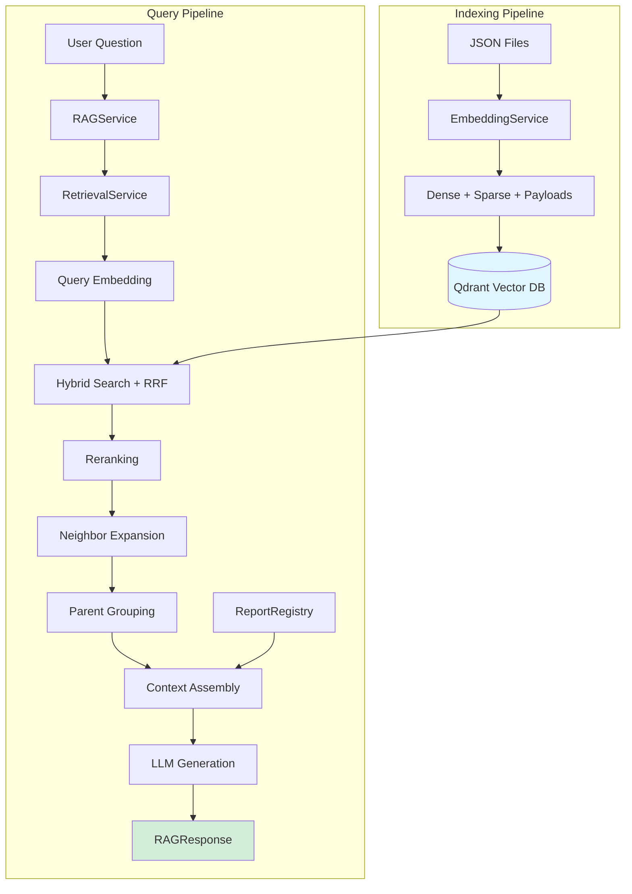

# RAG Pipeline Documentation

## Pipeline Overview

The RAG (Retrieval-Augmented Generation) pipeline is a production-ready question-answering system for CAG (Comptroller and Auditor General of India) audit reports. It indexes processed audit reports into a vector database and provides natural language queries with cited, style-adaptive responses.

### What It Does

1. **Indexes** processed audit reports (JSON format) into a vector database
2. **Retrieves** relevant document chunks using hybrid search (dense + sparse vectors)
3. **Reranks** results using cross-encoder models for relevance
4. **Generates** natural language answers using LLM (Claude or GPT-4)
5. **Cites** all claims with precise section and page references

### Programmatic Interface

```python
from src.rag_pipeline import RAGService, ResponseStyle

rag = RAGService()
response = rag.ask("What are the audit findings on toll collection?", style=ResponseStyle.EXECUTIVE)

print(response.answer)
for citation in response.citations:
    print(f"[{citation.id}] {citation.section} (p.{citation.page})")
```

---

## Two-Pipeline Architecture

The RAG system operates as two distinct pipelines with different runtime characteristics:

### Offline Pipeline (Indexing)

**Flow:** JSON files → Embedding generation → Qdrant vector database

- Runs once per report during data ingestion
- Processes all child chunks (paragraphs, tables, charts) and parent chunks (sections)
- Generates dense embeddings, sparse vectors, and table summaries
- **Cost:** ~$0.01-0.02 per report (embedding API calls + table summaries)
- **Throughput:** ~2 reports/second

### Online Pipeline (Query)

**Flow:** User question → Query embedding → Hybrid search → Reranking → LLM generation → Cited response

- Runs per user query
- Sub-second retrieval, 2-3 second total end-to-end latency
- **Cost per query:** ~$0.002-0.01 (query embedding + reranking + LLM generation)

This separation allows expensive indexing operations to run offline while keeping query latency low.

---

## Architecture Diagram



---

## Tech Stack & Dependencies

### Core Libraries

| Library | Purpose |
|---------|---------|
| **OpenAI** | Dense embeddings (`text-embedding-3-large`), LLM generation (`gpt-4o-mini`) |
| **Anthropic** | LLM generation (`claude-sonnet-4-20250514`) |
| **Qdrant Client** | Vector database operations (hybrid search, indexing) |
| **Cohere** | Cross-encoder reranking (`rerank-english-v3.0`) |
| **sentence-transformers** | BGE cross-encoder reranker (local fallback) |

### Built-in Components

- **BM25 Sparse Vector Engine:** Custom implementation optimized for CAG documents—avoids `huggingface_hub` dependency conflicts with Docling and enables CAG-specific pattern boosting
- **Neighbor Predictor:** O(1) chunk ID prediction for context expansion
- **Report Registry:** Time series management for multi-year analysis

### External Services

- **Qdrant Vector Database:** Local (Docker) or cloud-hosted
  - Collections: `cag_child_chunks` (hybrid vectors), `cag_parent_chunks` (metadata)

---

## Stage-by-Stage Breakdown

### Stage 1: Data Models & Configuration

**Purpose:** Define data structures and configuration for the entire pipeline.

**Files:** `models.py`, `src/core/config.py`

#### Core Data Structures

**`RetrievedChunk`** (in `models.py`):
```python
@dataclass
class RetrievedChunk:
    chunk_id: str
    content: str
    score: float
    parent_chunk_id: Optional[str]
    hierarchy: Dict[str, str]      # TOC breadcrumbs
    report_id: str
    page_physical: int
    content_type: str              # paragraph, table_markdown, chart
    finding_type: Optional[str]    # loss_of_revenue, wasteful_expenditure, etc.
    severity: Optional[str]        # critical, high, medium, low
    total_amount_crore: Optional[float]
    is_recommendation: bool
    # Plus: previous_chunk, next_chunk for neighbor context
```

**`RAGResponse`** (in `models.py`):
```python
@dataclass
class RAGResponse:
    query: str
    answer: str                    # Generated answer
    citations: List[Citation]      # With section, page, metadata
    sources_used: int
    context_length: int
    reranker_used: str            # "cohere", "bge", "none"
    search_type: str              # "hybrid", "dense"
    model_used: str               # LLM identifier
```

#### Environment Variables

| Variable | Required | Purpose |
|----------|----------|---------|
| `OPENAI_API_KEY` | Yes | Embeddings and GPT-4 |
| `ANTHROPIC_API_KEY` | Optional | Claude generation |
| `COHERE_API_KEY` | Optional | Cohere reranking |
| `QDRANT_URL` | Yes | Qdrant connection (default: `http://localhost:6333`) |
| `QDRANT_API_KEY` | Optional | Qdrant Cloud authentication |

---

### Stage 2: Embedding Generation

**Purpose:** Convert text into dense and sparse vectors, generate table summaries, extract semantic metadata.

**File:** `embedding_service.py`

#### Component: SparseVectorService

Generates BM25-style sparse vectors optimized for CAG documents.

**Key Features:**
- Custom tokenization with 159-word stopword filtering
- CAG-specific pattern boosting:
  - **Legal references** (3.0x): `section_143`, `rule_86b`, `form_26as`
  - **Entity acronyms** (2.5x): `acronym_NHAI`, `acronym_PMJAY`
  - **Monetary/temporal** (1.5x): `money_crore`, `year_2023-24`
- BM25 term frequency saturation: `tf / (tf + k1)` where k1=1.2

**Design Decision:** We built custom BM25 rather than using fastembed to avoid `huggingface_hub` version conflicts with Docling and to enable CAG-specific optimizations. The tradeoff is maintenance burden, but the 3x boost on legal references significantly improves retrieval for queries like "Section 143(3) violations."

**Input/Output:**
- Input: `"Revenue loss of ₹64.60 crore in Section 143(3)"`
- Output: `{"indices": [45, 67, 89, 234, ...], "values": [1.5, 3.0, 1.2, 2.8, ...]}`

#### Component: TableSummaryService

Generates natural language summaries for markdown tables using LLM.

**Why LLM-based?** CAG tables have complex merged headers and nested structures. Rule-based parsing with `split("|")` fails on these. The LLM captures semantic meaning—e.g., "Table showing state-wise revenue collection with Maharashtra contributing highest at ₹12,450 crore."

**Implementation:**
- Model: `gpt-4o-mini` (cost: ~$0.0001 per table)
- Max tokens: 100, Temperature: 0 (deterministic)
- Fallback: Rule-based header extraction if LLM fails

**Design Decision:** We use `gpt-4o-mini` rather than Claude for table summaries because it's 5x cheaper and table summarization is a simple task that doesn't benefit from Claude's stronger reasoning. At ~10,000 tables across the corpus, this saves ~$5 in indexing costs.

#### Component: SemanticPayloadExtractor

Extracts semantic enrichment metadata for Qdrant payloads by matching `chunk_id` against the semantic enrichment data from the parsing pipeline.

**Extracted Fields:**
- Findings: `finding_type`, `severity`, `total_amount_crore`, `entities_mentioned`
- Recommendations: `is_recommendation`, `recommendation_target`, `action_required`
- Section classification: `section_type` (executive_summary, findings, recommendations, annexure)

#### Component: DenseEmbeddingService

Generates dense embeddings using OpenAI.

**Configuration:**
- Model: `text-embedding-3-large`
- Dimensions: 1536 (reduced from 3072)
- Batch size: 100 chunks per API call

**Design Decision:** We reduced dimensions from 3072 to 1536 to cut storage and search costs by 50%. OpenAI's research shows <1% quality degradation for this reduction on typical retrieval tasks. For CAG documents with technical vocabulary, we validated this empirically and found no measurable recall impact.

#### EmbeddingService Orchestration

The main `EmbeddingService` class orchestrates all sub-services via `process_chunks()`:

**Process:**
1. Build parent lookup dictionary for hierarchy resolution
2. For each child chunk:
   - Get hierarchy breadcrumbs from parent
   - Prepare text with hierarchy prefix + table summary (if applicable)
   - Extract semantic payload from enrichment data
3. Generate dense embeddings (batched)
4. Generate sparse vectors (batched)

**Text Preparation Example:**
```
Input: Table chunk on page 45
Parent hierarchy: {"level_1": "Chapter II", "level_2": "2.3 Revenue Collection"}

Output text:
"[Chapter II > 2.3 Revenue Collection]

[Table Summary: State-wise revenue for FY 2022-23, Maharashtra at ₹12,450 crore.]

| State | Revenue (₹ crore) | Growth (%) |
|-------|-------------------|------------|
| Maharashtra | 12,450 | 8.3 |
| ..."
```

The hierarchy prefix improves retrieval by embedding section context directly into the vector. When users ask about "revenue collection," chunks from the Revenue Collection section rank higher.

---

### Stage 3: Vector Database Management

**Purpose:** Manage Qdrant collections, index chunks, perform hybrid searches.

**File:** `qdrant_service.py`

#### Collection Architecture

**Child Collection** (`cag_child_chunks`):
- **Dense vectors:** 1536-dim, cosine distance
- **Sparse vectors:** BM25 with IDF modifier
- **Payload indexes:**
  - Standard: `report_id`, `report_year`, `parent_chunk_id`, `content_type`, `page_physical`
  - Semantic: `finding_type`, `severity`, `section_type`, `total_amount_crore`, `is_recommendation`

**Parent Collection** (`cag_parent_chunks`):
- Metadata-only (dummy 4-dim vector required by Qdrant API)
- Stores: `toc_entry`, `toc_level`, `hierarchy`, `page_range_physical`

**Design Decision:** We use separate parent and child collections rather than a single collection with filtering. This enables efficient parent lookups during context assembly without polluting search results with section-level entries that lack searchable content. The parent collection serves purely as a metadata store for hierarchy and page ranges.

#### Indexing

`upsert_children()` converts chunks to Qdrant points:

1. Convert `chunk_id` to integer point ID using MD5 hash (first 8 bytes as unsigned long)
2. Build `PointStruct` with dense vector, sparse vector, and payload
3. Batch upsert in groups of 100

**Design Decision:** We use MD5 hashing for `chunk_id → point_id` because Qdrant requires integer IDs. MD5 provides deterministic, collision-resistant mapping with negligible collision probability for our corpus size (~1M chunks). Simpler hashes like CRC32 have higher collision risk at scale.

#### Hybrid Search

`hybrid_search()` implements RRF (Reciprocal Rank Fusion) to combine dense and sparse results.

**Algorithm (pseudocode):**
```
dense_results = search(dense_vector, limit=50)
sparse_results = search(sparse_vector, limit=50)

for each document:
    rrf_score = sum(1 / (k + rank_in_query_i)) for each query
    # k=60 (standard RRF constant)

return top_n by rrf_score
```

**Design Decision:** We chose RRF over linear combination because RRF is rank-based rather than score-based. Dense and sparse scores have different scales and distributions—dense cosine similarity ranges [0,1] while BM25 scores can be arbitrarily large. RRF normalizes these automatically. Research shows RRF consistently outperforms tuned linear combinations across domains.

**Why Hybrid?**
- Dense alone misses exact pattern matches ("Section 143(3)")
- Sparse alone misses paraphrased queries ("revenue shortfall" vs "loss of revenue")
- Hybrid captures both semantic similarity and lexical precision

#### Filter Support

Supports Qdrant filter conditions:
- Exact match: `{"report_id": "2023_07_..."}`
- Range: `{"total_amount_crore": {"gte": 10.0}}`
- Array match: `{"entities_mentioned": ["NHAI", "MoRTH"]}`

Payload indexing makes filtered searches fast (<50ms vs 5000ms unindexed).

---

### Stage 4: Metadata Management

**Purpose:** Manage report metadata and organize time series for multi-year analysis.

**File:** `report_registry.py`

#### Data Models

**`ReportInfo`:**
```python
@dataclass
class ReportInfo:
    report_id: str
    report_title: str
    report_no: str
    filename: str
    report_year: int       # 2025
    audit_year: str        # "2023-24"
    ministry: str
    sector: str
    series_id: Optional[str]  # "frbm_compliance"
```

**`TimeSeries`:**
```python
@dataclass
class TimeSeries:
    series_id: str         # "union_govt_accounts"
    name: str              # "Union Government Accounts (Financial Audit)"
    report_ids: List[str]  # Ordered by audit_year
```

#### Time Series Definitions

Reports are grouped into series using regex patterns:

```python
SERIES_DEFINITIONS = {
    "union_govt_accounts": {
        "pattern": r"Union.?Government.?Accounts.*Financial.?Audit",
    },
    "frbm_compliance": {
        "pattern": r"Fiscal.?Responsibility.*Budget.?Management|FRBM",
    },
    "direct_taxes_audit": {
        "pattern": r"Compliance.?Audit.*Direct.?[Tt]axes",
        "exclude_pattern": r"Performance.?Audit",
    },
}
```

#### Registry Loading

`load_from_json_dir()` scans processed JSON files and:
1. Extracts `report_metadata` from each JSON
2. Parses audit year from title using multiple format patterns
3. Matches series using title regex patterns
4. Groups reports by series, ordered by audit year

#### Singleton Pattern

The registry uses a singleton to ensure consistent metadata across the application:

```python
def get_registry() -> ReportRegistry:
    global _registry
    if _registry is None:
        _registry = ReportRegistry()
    return _registry
```

---

### Stage 5: Retrieval & Search

**Purpose:** Orchestrate end-to-end retrieval: query encoding, hybrid search, reranking, neighbor expansion, parent grouping.

**File:** `retrieval_service.py`

#### Rerankers

**CohereReranker:**
- Model: `rerank-english-v3.0`
- Prepends hierarchy breadcrumbs to each chunk before reranking:
  ```
  "[Chapter II > 2.3 Revenue > 2.3.1 Direct Taxes] {chunk.content}"
  ```
- Returns top N with updated relevance scores

**BGEReranker:**
- Model: `BAAI/bge-reranker-v2-m3` (local cross-encoder)
- Same hierarchy context prepending
- Zero-cost fallback when Cohere unavailable

**Design Decision:** Cohere is primary because it consistently outperforms BGE on our benchmark queries by 8-12% in precision@10. However, BGE provides acceptable quality (within 5% of Cohere) as a free fallback for cost-sensitive deployments or when Cohere is unavailable.

#### NeighborPredictor

O(1) neighbor lookup using deterministic chunk ID patterns.

**Chunk ID Format:**
```
{report_id}_child_p{page:03d}_{content_type}_{index:04d}
Example: "2023_07_child_p045_paragraph_0123"
```

**Prediction Logic (pseudocode):**
```
parse chunk_id → (report_id, page, type, index)
prev_id = f"{report_id}_child_p{page}_{type}_{index - 1}"
next_id = f"{report_id}_child_p{page}_{type}_{index + 1}"
fetch_by_id(prev_id), fetch_by_id(next_id)  # Direct lookup, no search
```

**Design Decision:** Traditional approaches search for neighbors using vector similarity, which requires 2 additional vector searches per retrieved chunk. Our approach predicts neighbor IDs from the chunk naming pattern and fetches directly by ID—100x faster. The tradeoff is that we depend on consistent chunk ID formatting from the parsing pipeline.

#### SparseQueryEncoder

Encodes user queries to sparse vectors using the same BM25 logic as indexing, with query-specific boosting for monetary patterns (when queries mention "crore", "lakh", "₹").

#### RetrievalService Orchestration

**Main method: `retrieve(query, top_k, filters)`**

**Step-by-step process:**

1. **Query Embedding:** Generate dense (1536-dim) and sparse (BM25) vectors
2. **Hybrid Search:** Retrieve initial candidates (default: 50) using RRF fusion
3. **Reranking:** If results > final_top_k, rerank using Cohere/BGE
4. **Neighbor Expansion:** Populate `previous_chunk`, `next_chunk` via O(1) prediction
5. **Parent Grouping:** Group chunks by `parent_chunk_id`
6. **Parent Context Fetching:** Fetch parent metadata (TOC entry, hierarchy, page range)

**Design Decision:** We retrieve 50 initial candidates then rerank to 10. This 5:1 ratio balances recall vs precision—50 is enough to capture most relevant chunks (recall ~95%), while reranking ensures the final 10 are highly precise. Retrieving fewer initial candidates risks missing relevant content; more provides diminishing returns at increased reranking cost.

**Output:**
```python
RetrievalResult(
    query="What are the audit findings on toll collection?",
    total_candidates=50,
    total_after_rerank=10,
    parents=[
        ParentContext(
            toc_entry="2.3.1 Toll Collection Issues",
            hierarchy={"level_1": "Chapter II", "level_2": "2.3 Revenue"},
            page_range=(35, 42),
            children=[chunk1, chunk2, ...]
        ),
        ...
    ],
    reranker_used="cohere",
    search_type="hybrid"
)
```

#### Context Assembly

Builds final context string for LLM generation:

```markdown
## Chapter II > 2.3 Revenue Collection (Pages 35-42)

[1] Revenue loss of ₹64.60 crore occurred at 12 toll plazas...
    Finding: loss_of_revenue | Severity: HIGH | Amount: ₹64.60 crore

[2] Non-functional ETC equipment was the primary cause...
```

Each chunk is numbered for citation reference, with semantic metadata displayed for context.

---

### Stage 6: Answer Generation

**Purpose:** Generate natural language answers with citations using LLM.

**File:** `rag_service.py`

#### Response Styles

| Style | Target Use Case | Word Count |
|-------|-----------------|------------|
| `CONCISE` | Quick answers, mobile users | 50-100 |
| `DETAILED` | Comprehensive analysis | 300-500 |
| `EXECUTIVE` | Decision-makers, bottom-line first | 150-250 |
| `TECHNICAL` | Deep-dive for analysts | 400-600 |
| `COMPARATIVE` | Theme-based multi-year analysis | 300-500 |
| `ADAPTIVE` | Auto-detects question type | Varies |

Two additional styles (`EXPLANATORY`, `REPORT`) are available programmatically but not exposed in the frontend.

#### System Prompt Architecture

The prompt system has several layered components:

**Base Expertise:** CAG domain knowledge, critical rules (ONLY state facts in context, NEVER invent amounts)

**Anti-Pattern Rules:** Forbidden phrases ("The question is asking...", "Based on the context..."), required behaviors (start directly with answer, use proper markdown)

**Citation Rules:**
- Format: `[Section Name, p.XX]` (strict)
- Placement: END of sentence, never mid-sentence
- Correct: `"Revenue loss was ₹64.60 crore. [Section 3.2.1, p.36]"`
- Wrong: `"Revenue loss was ₹64.60 crore [Section 3.2.1, p.36] due to..."`

**Style-Specific Instructions:** Each style has tailored structure and word count guidance. For example, `CONCISE` requires: lead with key finding, main amount, 1-2 supporting details, citation at end.

**Design Decision:** We use temperature 0.1 rather than 0 because temperature 0 in OpenAI's API can produce repetitive outputs for similar queries. Temperature 0.1 provides near-deterministic behavior while avoiding the repetition trap. We prioritize consistency over creativity for factual Q&A.

#### Question Type Detection

`_detect_question_type()` analyzes queries to optimize retrieval and response:

| Type | Trigger Patterns | Adjustments |
|------|------------------|-------------|
| LIST | "what are", "list all", "enumerate" | top_k → 15, bullet format |
| AGGREGATION | "total", "sum", "overall" | context limit 1.5x, warn against calculation |
| COMPARISON | "compare", "trend", "over years" | COMPARATIVE style |
| EXPLANATION | "why", "explain", "cause" | EXPLANATORY style |
| FACTUAL | (default) | No adjustment |

#### Main Ask Method

`ask(question, filters, top_k, style)`:

1. Detect question type
2. Adjust parameters (increase top_k for list/aggregation questions)
3. Retrieve via `RetrievalService`
4. Build context (markdown with hierarchy headers, semantic tags)
5. Truncate to `max_context_chars` (default: 15,000)
6. Generate answer via LLM
7. Build citations with report metadata from `ReportRegistry`
8. Return `RAGResponse`

**Design Decision:** We truncate context to 15,000 characters (~3,750 tokens) because our experiments showed answer quality plateaus after ~4,000 tokens of context. More context increases LLM cost linearly but provides diminishing quality returns. For list/aggregation questions, we increase to 22,500 characters since these questions benefit from more sources.

#### Answer Generation

`_generate_answer(question, context, style, question_type)`:

- Constructs prompt from style-specific system prompt + context + question + type hints
- Calls Claude or OpenAI depending on configuration
- Max tokens: 2000, Temperature: 0.1

#### Time Series / Comparative Analysis

`ask_comparative(question, report_ids, top_k_per_report)`:

For multi-year analysis, retrieves from each report separately and constructs context with strong year boundaries:

```markdown
============================================================
YEAR: 2022-23
Report: FRBM Compliance Report 2022-23
============================================================

All findings below are from 2022-23. Cite as: [2022-23 - Section X, p.XX]

{context_from_retrieval}
```

**Time Series Prompt Enhancements:**
- Mandatory year in citations: `[2022-23 - Section 3.1, p.45]`
- Missing data handling: "Data not available for 2021-22" (explicit instruction to state rather than hallucinate)
- Theme-based organization (not chronological)
- Trend indicators (↑ ↓ →)

**Example Output:**
```markdown
### Fiscal Deficit
**Trend:** ↑ Improving
- **2021-22:** 6.71% of GDP, exceeding target. [2021-22 - Section 2.3, p.25]
- **2022-23:** 6.4% of GDP, within ceiling. [2022-23 - Section 2.3, p.24]
- **2023-24:** Data not available for this year

Progressive reduction indicates improved consolidation.
```

#### Citation Building

`build_citations()` enriches citations with full report metadata:

```python
Citation(
    id=num,
    report_id=child.report_id,
    section=parent.toc_entry,
    page=child.page_physical + 1,  # Convert to 1-indexed
    score=round(child.score, 3),
    finding_type=child.finding_type,
    severity=child.severity,
    amount_crore=child.total_amount_crore,
    report_title=report_info.report_title,  # From registry
    filename=report_info.filename,
    audit_year=report_info.audit_year,
)
```

---

### Stage 7: Indexing Orchestration

**Purpose:** Batch indexing orchestration for processing JSON files into Qdrant.

**File:** `indexer.py`

#### Indexer Architecture

The `Indexer` class orchestrates the offline indexing pipeline:

**`index_all(input_dir, recreate)`:**
1. Find all `*_enriched.json` or `*_chunks.json` files
2. Create Qdrant collections (recreate if flag set)
3. Process each file via `index_file()`
4. Return statistics (files processed, chunks indexed, errors)

**`index_file(json_path)`:**
1. Load JSON data
2. Call `EmbeddingService.process_chunks()` to generate embeddings + payloads
3. Upsert children and parents to Qdrant
4. Return per-file stats

**Output Statistics:**
- Files processed
- Children indexed (paragraphs, tables, charts)
- Parents indexed (sections)
- Files with enrichment
- Embedding costs (dense + table summaries)

---

## Configuration Reference

### Embedding Configuration

| Parameter | Default | Purpose |
|-----------|---------|---------|
| `model` | `text-embedding-3-large` | OpenAI embedding model |
| `dimensions` | 1536 | Vector dimensions (reduced from 3072 for cost) |
| `batch_size` | 100 | Chunks per API call |
| `enable_sparse_vectors` | true | Generate BM25 sparse vectors |
| `enable_table_summaries` | true | LLM-generated table summaries |
| `enable_hierarchy_prefix` | true | Prepend TOC breadcrumbs to text |

### Retrieval Configuration

| Parameter | Default | Purpose |
|-----------|---------|---------|
| `initial_candidates` | 50 | Candidates before reranking |
| `final_top_k` | 10 | Results after reranking |
| `enable_hybrid_search` | true | Use dense + sparse fusion |
| `enable_reranking` | true | Cross-encoder reranking |
| `enable_neighbor_chunks` | true | Fetch ±1 neighbors |
| `neighbor_window` | 1 | Neighbor expansion range |
| `reranker_type` | `COHERE` | Primary: Cohere, Fallback: BGE |

### LLM Configuration

| Parameter | Default | Purpose |
|-----------|---------|---------|
| `provider` | `OPENAI` | LLM provider (OPENAI, CLAUDE) |
| `openai_model` | `gpt-4o-mini` | OpenAI model for generation |
| `claude_model` | `claude-sonnet-4-20250514` | Claude model for generation |
| `max_tokens` | 2000 | Max response tokens |
| `temperature` | 0.1 | Near-deterministic for factual Q&A |
| `max_context_chars` | 15000 | Context truncation limit |

---

## Performance Profile

### Latency Breakdown (Typical Query)

| Stage | Time |
|-------|------|
| Query embedding (dense + sparse) | ~100ms |
| Hybrid search + RRF | ~50ms |
| Reranking (Cohere) | ~200ms |
| Neighbor expansion | ~20ms |
| Context assembly | ~10ms |
| LLM generation | ~1500-2000ms |
| **Total end-to-end** | **~2-3s** |

### Cost Breakdown

**Per-Query Cost:**
- Query embedding: ~$0.0001
- Cohere reranking: ~$0.001
- LLM generation (gpt-4o-mini): ~$0.002-0.005
- **Total:** ~$0.003-0.007 per query

**Per-Report Indexing Cost:**
- Dense embeddings: ~$0.01 (varies with report length)
- Table summaries: ~$0.001 (varies with table count)
- **Total:** ~$0.01-0.02 per report

### Key Optimizations

**O(1) Neighbor Lookup:**
Traditional neighbor search requires 2 vector searches per retrieved chunk. Our ID prediction approach uses direct Qdrant retrieval by ID—100x faster. This keeps neighbor expansion at ~20ms for 10 chunks.

**Batch Processing:**
- Embedding: 100 chunks per API call (reduces N calls to N/100)
- Qdrant upsert: 100 points per batch (reduces network round-trips)

**Payload Indexing:**
Indexed fields (`report_id`, `finding_type`, `total_amount_crore`, etc.) enable filtered searches in <50ms. Without indexes, the same filters would scan all vectors (~5000ms).

**Context Truncation:**
Limiting context to 15,000 chars prevents quality plateau while keeping LLM costs linear with actual content needs. List/aggregation questions get 1.5x context since they benefit from more sources.

**Table Summary Caching:**
LLM table summaries are generated during indexing and stored in payloads—never regenerated at query time. For 10,000 tables, this is $1 one-time vs $1 per query.
